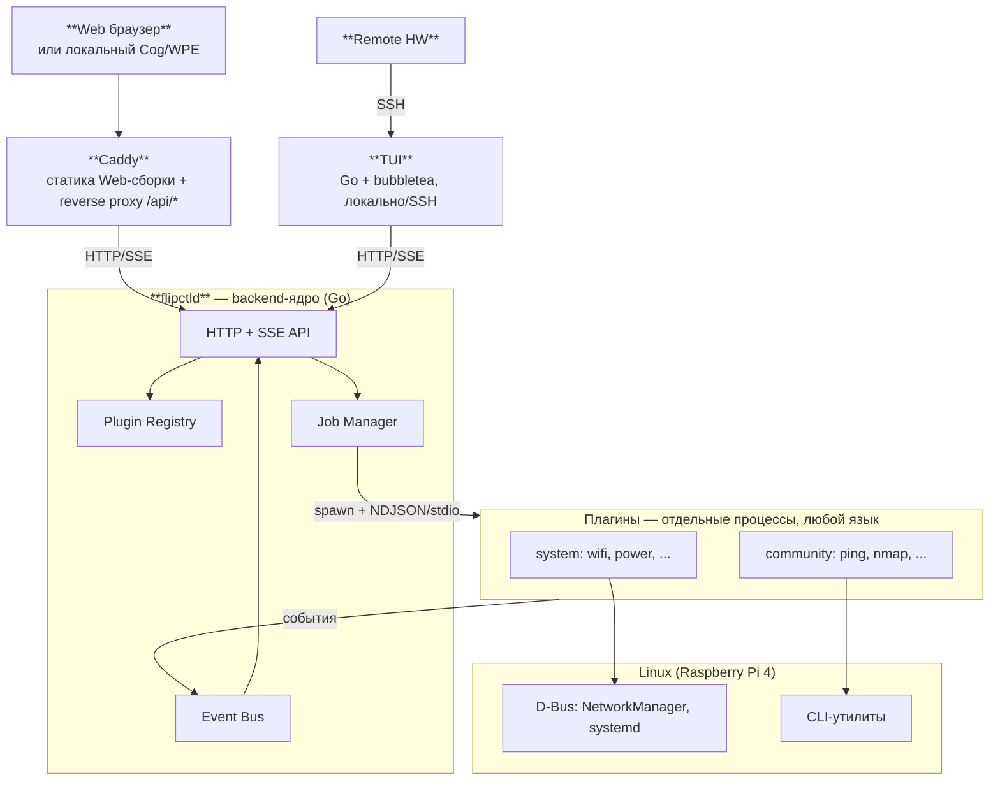

# FlipCTL — архитектура (сжатая версия)

> Полные версии: [`frontend.md`](./frontend.md), [`backend.md`](./backend.md). Формальные схемы — [`contract/`](./contract/README.md). Этот файл — выжимка для онбординга и обсуждений в команде.

**Миссия:** удобный доступ к инструментам Linux (сеть, systemd, процессы) через маленький экран — Web, TUI по SSH, позже физическая панель.

## Общая архитектура



Ключевая идея: **общий контракт, не общий код.** Web, TUI и backend — три независимых, идиоматичных для своей платформы стека, связанных API/схемами (`contract/`), а не общим рантаймом.

## Frontend

- **Web** — React + `react-dom`, рендер в один `<canvas>` (`PixelSurface`/`CanvasSurface`) ради pixel-perfect 1-bit стиля прототипа `fake-flipctl2`. Без Yoga — фиксированные пиксельные константы, как в оригинале.
- **TUI** — Go + `bubbletea`/`lipgloss`/`bubbles`. Тот же язык, что backend — реальная синергия общих типов (`contract/go/apitypes`), не задокументированный на будущее план. Не pixel-perfect, обычный текстовый UI. Компилируемый бинарник, экономия ресурсов на RPi4. SSH — через forced-command системного `sshd` (или `wish` в будущем).
- Общее между Web и TUI:
  - семантика ввода (`InputAction`: Up/Down/Ok/Back/Ptt/...);
  - модель навигации (стек экранов + отдельный overlay-стек);
  - реестр приложений — приходит из backend, не хранится во frontend.
- `GET /api/registry` в рантайме:
  ```jsonc
  { "id": "ping", "kind": "generic",
    "inputs": [{ "id": "target", "type": "text" }],
    "actions": [{ "id": "run", "endpoint": "/api/plugins/ping/run", "bind": "slot:2" }] }
  ```
  - `kind: "custom"` → написанный вручную экран (Wi-Fi, Ethernet, Power).
  - `kind: "generic"` → один общий компонент (`GenericActionScreen`/`generic_action.rs`) для простых CLI-wrapper плагинов, без platform-специфичного кода на каждый новый плагин.

## Backend

- **`flipctld` (Go)** — тонкий супервизор, не хранилище бизнес-логики. Заменяет `server.js` (был монолитом на ~5000 строк, спавнил утилиты и парсил вывод регулярками — не масштабировалось). Только API — статику Web-сборки и внешний вход берёт на себя отдельный `Caddy` перед ним (reverse proxy `/api/*`), не сам `flipctld`.
- **Плагины** — отдельные OS-процессы, любой язык (единственное требование — читать/писать JSON). Три независимые оси классификации:
  - `tier`: `system` (пишем мы, обязательные — Wi-Fi, power, cron) | `community` (ping, nmap).
  - `execution`: `one-shot` (запустился/отработал/вышел) | `stream` (живёт, шлёт события) | `daemon` (живёт вместе с ядром, независимо от клиентов).
  - `ui_kind`: `custom` | `generic`.
- **IPC** — NDJSON поверх stdin/stdout:
  ```json
  {"type":"start","inputs":{"target":"8.8.8.8"}}
  {"type":"output","fields":{"status":"reachable","rtt_ms":13.2}}
  {"type":"done","exit_code":0}
  ```
- **Job / Session / Event Bus** — job общий для всех клиентов с самого начала: кто угодно может подписаться на уже бегущий job через SSE (Web и TUI видят один и тот же живой поток одновременно).

  ```mermaid
  stateDiagram-v2
      [*] --> Running: spawn OK
      Running --> Completed: done
      Running --> Stopped: stop_job
      Completed --> [*]
      Stopped --> [*]
  ```

- **Софт-кнопки**: у action в манифесте есть `bind` (`slot:0..4` — позиция в панели экрана, либо `input:ptt` — универсальное действие) и раздельные `on_press`/`on_release` с эффектом `start_job | stop_job | send_event`. `send_event` шлёт именованное событие в stdin уже бегущего процесса (push-to-talk), не спавнит новый.
- **System-плагины используют D-Bus** (NetworkManager/systemd напрямую) вместо CLI+regex — та же ошибка `server.js`, которую нельзя повторять внутри плагина.
- **Привилегии**: пока все плагины равнодоверенные (осознанно отложено). Кандидат на будущее — D-Bus policy + **polkit**, тот же стек, что использует сам NetworkManager; работает только если у каждого плагина свой D-Bus-идентити (плагин сам держит клиента, не `flipctld` от его имени).

## Контракт (`contract/`)

- `openapi.yaml` — HTTP/SSE API (`/api/registry`, `/api/plugins/{id}/{action}`, `/api/jobs/*`).
- `manifest.schema.json` — JSON Schema манифеста плагина.
- `ipc-messages.schema.json` — схема NDJSON-сообщений `flipctld` ↔ плагин.
- Формализовано, чтобы риск ручной рассинхронизации типов закрывался кодогенерацией: backend и TUI (оба на Go) используют один сгенерированный пакет `contract/go/apitypes` напрямую, Web (TypeScript) — отдельно генерирует TS-типы из той же схемы.

## Принятые trade-off'ы (не забыть)

- Backend = **Go**, TUI изначально была **Rust** — синергия типов не достигалась автоматически, это было принято как есть. Пересмотрено: TUI переписана на **Go** (`bubbletea`) специально ради синергии — теперь backend и TUI используют общий сгенерированный пакет типов напрямую.
- Sandboxing плагинов — отложен, дыра осознана и задокументирована, не забыта.
- Слот-панель софт-кнопок как формальный UI Kit примитив — в бэклоге.
- Caddy как отдельный процесс (вариант B) выбран сознательно ради низкого порога входа и независимого релиза Web-фронтенда — цена: второй резидентный процесс на RPi4. Путь назад к раздаче статики самим `flipctld` (вариант C) — дешёвая миграция, не переделка архитектуры.
