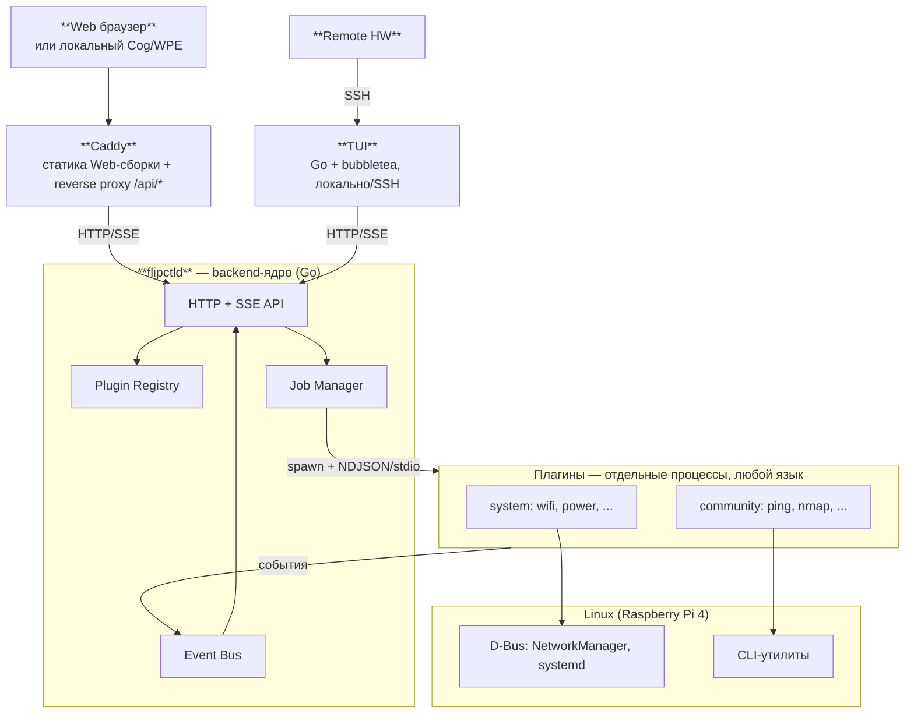

# FlipCTL — архитектура (сжатая версия)

> Полные версии: [`frontend.md`](./frontend.md), [`backend.md`](./backend.md). Этот файл — выжимка для онбординга.

**Цель:** удобный доступ к инструментам Linux (сеть, systemd, процессы) через pixel-perfect интерфейс небольшого экрана с огранниченным набором физических кнопок.

## Общая архитектура



Ключевые идеи:
- **общий контракт, вместо общего кода.** Frontend (Web и TUI) и backend — три независимых, идиоматичных для своей платформы стека, связанных API/схемами (`contract/`), а не общим рантаймом.
- **Система пользовательских и ситемных плагинов в лёгкой Go обертке**. Плагины можно писать на любом подходящем языке или использовать готовые механизмы Линукса типа D-bus, libs (libcurl).
- **Основа GUI выполнена на web технологиях**. Легко разрабатывать, дешево поддерживать.
- **Web и TUI используют общий API к бекэнду, но не шарят между собой UI логику и ассеты**. Имеют раздельные движки для рендеринга.
- **Рендеринг на экран устройства осуществляется из headless браузера через Linux DRM**. Нет возни с драйверами, небольшой футпринт памяти. Полноценный веб-интерфейс в качестве бонуса.

## Frontend

- **Web** — React + `react-dom`, рендер в один `<canvas>` (`PixelSurface`/`CanvasSurface`) ради pixel-perfect 1-bit стиля прототипа. Не используем Yoga пытаясь объединить UI с TUI. Вместо этого используем фиксированные пиксельные константы, как в `fake-FlipCTL`.
- **TUI** — Go + `bubbletea`/`lipgloss`/`bubbles`. Тот же язык, что backend — реальная синергия общих типов (`contract/go/apitypes`). Не pixel-perfect, обычный текстовый UI. Компилируемый бинарник, экономия ресурсов на портативном SBC. SSH — через forced-command системного `sshd` (или `wish` из того же стека `bubbletea`).
- Общее между Web и TUI:
  - семантика ввода (`InputAction`: Up/Down/Ok/Back/SoftKey1/...);
  - модель навигации (стек экранов + отдельный overlay-стек);
  - реестр приложений — приходит из backend registry manager, не хранится во frontend.
- Пример **одного элемента** массива, который отдаёт `GET /api/registry` — так backend описывает фронтенду один конкретный плагин (`ping`); реестр целиком — это массив таких объектов, по одному на каждый установленный плагин:
  ```jsonc
  { "id": "ping", "kind": "generic",
    "inputs": [{ "id": "target", "type": "text" }],
    "actions": [{ "id": "run", "endpoint": "/api/plugins/ping/run", "bind": "slot:2" }] }
  ```
  - `id` — уникальный идентификатор плагина; из него строятся все остальные пути (`/api/plugins/ping/...`).
  - `kind: "generic"` — фронтенду не нужно искать написанный вручную экран, плагин рисуется общим компонентом `GenericActionScreen.tsx`/`generic_action.go`. Для сравнения: `kind: "custom"` → написанный вручную экран (Wi-Fi, Ethernet, Power) со своей логикой.
  - `inputs` — поля, которые пользователь заполняет перед запуском. Здесь одно текстовое поле `target` — на экране появится строка ввода; то, что туда впишут, уйдёт в плагин под тем же ключом `target` (см. IPC-пример ниже — это один и тот же `ping`, просто на следующем шаге).
  - `actions` — софт-кнопки экрана.

## Backend

- **`flipctld` (Go)** — тонкий супервизор. Не хранилище бизнес-логики. Заменяет `server.js` из `fake-FlipCTL`. Реализует API в то время, как статику Web-сборки и внешние обращения берёт на себя отдельный `Caddy`. Перед ним (reverse proxy `/api/*`), не сам `flipctld`.
- **Плагины** — отдельные OS-процессы. Можно использовать любой язык (единственное требование — читать/писать JSON). Подключаютсячерез небольшую обёртку на Go. Упакованы вместе с манифестом, бинарниками, иконками, декларативным описанием UI. Можно делить и классифицировать их по разным параметрам.

  - По уровню доступа `tier`:
    - `system` (Wi-Fi, power, cron, ...) — обязательный базовый минимум. Написаны и проверены командой Flipper.
    - `community` (ping, nmapб curl, ...) — пользовательские.
  - По типу запуска `execution`:
    - `one-shot` — запустился/отработал/вышел. `whoami`.
    - `stream` — живёт, шлёт данные и события. `ping`
    - `daemon`  — живёт независимо от клиентов, большую часть времени чё-то ждёт. Например система уведомлений.
  - По типу UI `ui_type`:
    - `custom` — собственный уникальный UI, который представлен настоящими ассетами в `frontend/UI`.
    - `generic` — использует примитивы из дефолтового UI-kit: list, grid, MenuBar, softKeys, dropDown, ...

- **IPC** — отдельный протокол между `flipctld` и конкретным запущенным процессом плагина; инициализируется сразу после того, как пользователь нажал кнопку из примера выше. NDJSON = по одному JSON-объекту на строку — самый простой формат, не требует библиотек ни на одном языке:
  ```json
  {"type":"start","inputs":{"target":"8.8.8.8"}}
  {"type":"output","fields":{"status":"reachable","rtt_ms":13.2}}
  {"type":"done","exit_code":0}
  ```
  - Строка 2 — плагин пишет в свой **stdout**: вызвал системный `ping`, распарсил его вывод сам и отдал уже структурированный результат (`status`, `rtt_ms` — поля, объявленные в манифесте плагина как `outputs`). `flipctld` принимает эту строку и рассылает её всем клиентам, подписанным на этот job, через SSE — в том числе тем, кто job не запускал.

- **Job / Session / Event Bus** — job общий для всех клиентов с самого начала: кто угодно может подписаться на уже бегущий job через SSE (Web и TUI видят один и тот же живой поток одновременно). Состояний больше, чем "работает/не работает" — важно различать, на каком именно этапе всё пошло не так:

  ```mermaid
  stateDiagram-v2
      [*] --> Pending: POST /api/plugins/{id}/{action}
      Pending --> Running: процесс заспавнен, получено "ready"
      Pending --> Failed: не удалось запустить процесс
      Running --> Completed: "done", exit_code=0
      Running --> Failed: "error" или exit_code != 0
      Running --> Stopped: stop_job (SIGTERM)
      Completed --> [*]
      Failed --> [*]
      Stopped --> [*]
  ```

- **Button input в плагинах**: у action в манифесте есть `bind` (`slot:0..4` — позиция в панели экрана, либо `input:back` — универсальное действие) и раздельные `on_press`/`on_release` с эффектом `start_job | stop_job | send_event`. `send_event` шлёт именованное событие в stdin уже бегущего процесса, не спавнит новый.
- **System-плагины могут (и должны) использовать D-Bus** (NetworkManager/systemd напрямую) вместо простого парсинга вывода CLI через regex.
- **Привилегии (временно отложены)**: пока все плагины равнодоверенные. Кандидат на будущее — D-Bus policy + **polkit**, тот же стек, что использует сам NetworkManager; работает только если у каждого плагина свой D-Bus-identity (плагин сам держит клиента, не `flipctld` от его имени).

## Контракт
- `contract/openapi.yaml` — HTTP/SSE API (`/api/registry`, `/api/plugins/{id}/{action}`, `/api/jobs/*`).
- `contract/manifest.schema.json` — JSON Schema манифеста плагина.
- `contract/ipc-messages.schema.json` — схема NDJSON-сообщений `flipctld` ↔ плагин.
- Формализовано, чтобы риск ручной рассинхронизации типов закрывался кодогенерацией: backend и TUI (оба на Go) используют один сгенерированный пакет `contract/go/apitypes` напрямую, Web (TypeScript) — отдельно генерирует TS-типы из той же схемы.

## Notes
- Был вариант сначала рисовать TUI и потом из него генерировать web — отброшен т.к. не добиться pixel perfect картинки на экране (в TUI мы оперируем вертикальной ячейкой, а не квадратным пикселем), а так же тянет за собой nodejs и WASM.
- Я бы наметил critical path и сделал быстрый прототип для проверки гипотез этой архитектуры. В нём бы вовсе не было ветки с TUI.
- Нужно менять или дорабатывать (или просто глубже ресёрчить) COG т.к. сейчас есть проблемы с его запуском в чистом DRM на реальном железе.
- Backend = **Go** (`bubbletea`) специально ради синергии — backend и TUI используют общий сгенерированный пакет типов напрямую. Bubbletea и вся его экосистема — старый, хорошо опробованный проект.
- Sandboxing плагинов — отложен.
- Система прав плагинов — отложено.
- Caddy как отдельный процесс выбран сознательно ради низкого порога входа и независимого релиза Web-фронтенда — цена: второй резидентный процесс на SBC.
