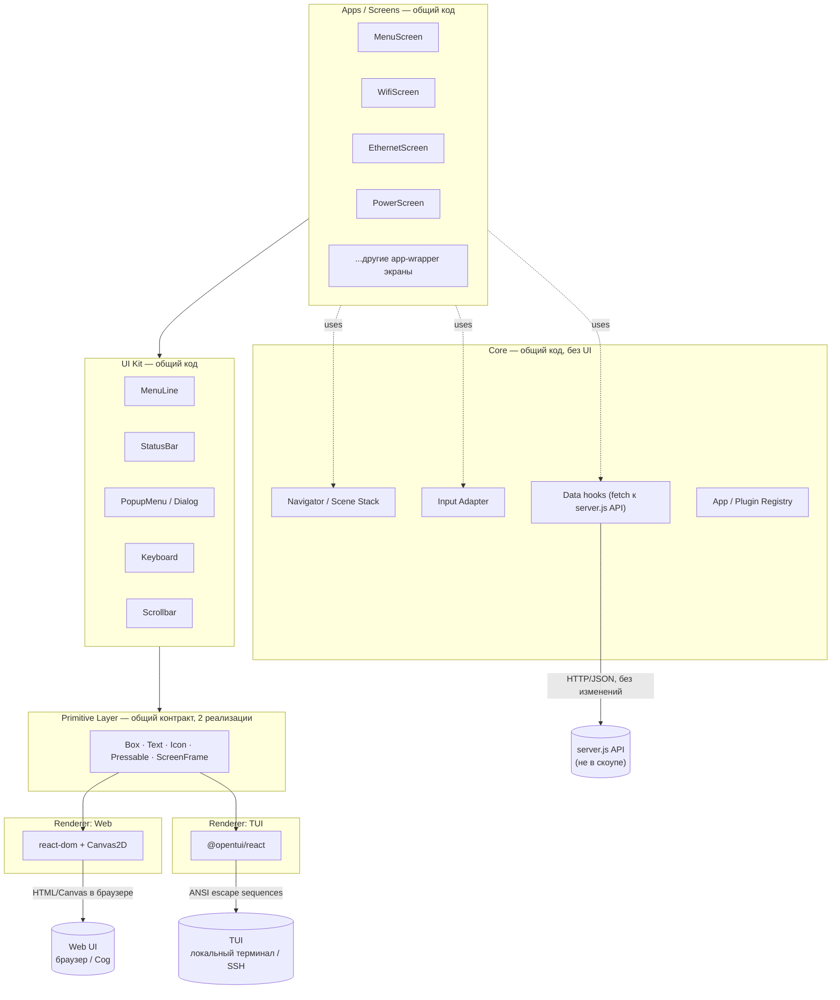
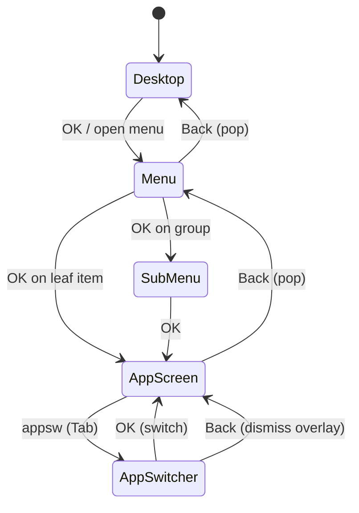
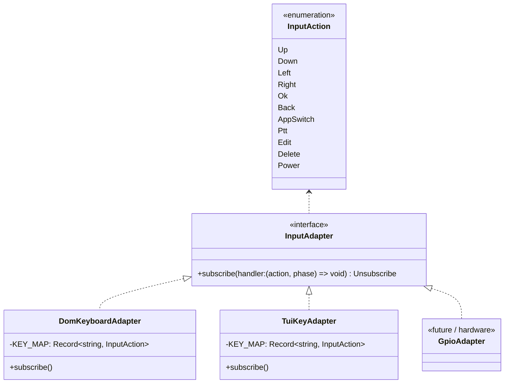
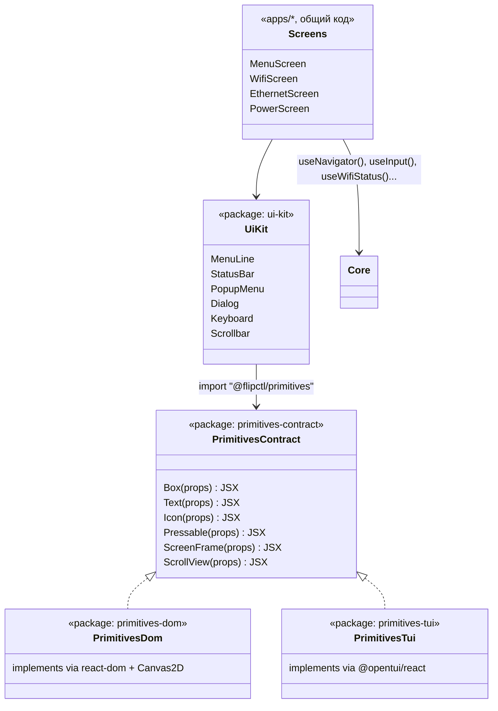
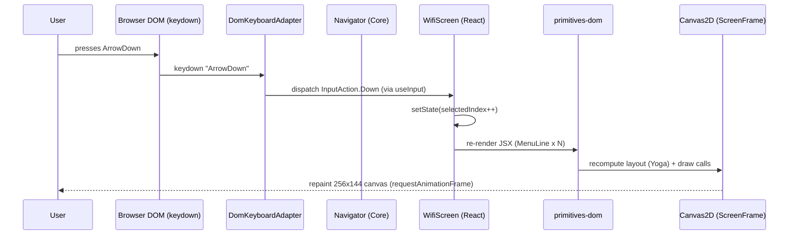
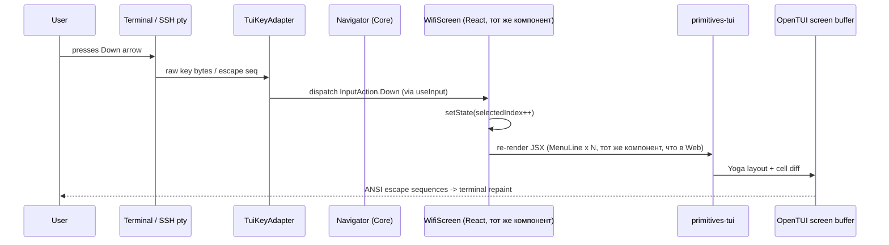
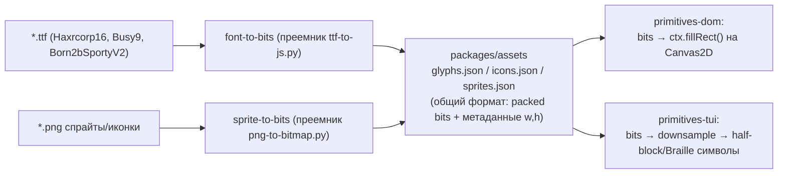

# FlipCTL — архитектура UI и Renderer-слоя (предложение)

> Область документа: только **UI Frontend** и **Renderer** из общей схемы FlipCTL (см. `README.md`). Backend (systemd/NetworkManager/CLI-wrapperы) не меняется и рассматривается как чёрный ящик с уже существующим HTTP/JSON API (`server.js` в `fake-flipctl2`). Целевые платформы PoC — **Web** и **TUI** (SSH/локальный терминал). Hardware-рендерер (Cog/DRM, FlipCTL Control Panel) в этом документе не проектируется, но архитектура сознательно оставляет для него точку расширения.

---

## 1. Постановка задачи

Из `README.md`:

- UI сейчас — HTML/JS, рендерится headless WebKit (Cog) прямо на DRM, без Xorg/Wayland.
- Хотим несколько renderer-ов для одного UI: как минимум Web и TUI, с прицелом на third target (hardware/DRM) в будущем.
- Внешний вид — жёстко заданный pixel-perfect 1-bit/grayscale стиль экрана 256×144 (см. `fake-flipctl2`), с кастомными bitmap-шрифтами и спрайтами.
- Web и TUI **не обязаны быть идентичными**, но должны быть узнаваемо одним и тем же интерфейсом (одна и та же навигация, один и тот же набор экранов, похожая раскладка).

Из анализа `fake-flipctl2` (детали в разделе 3) важно унести в новую архитектуру три вещи, которые там уже хорошо работают, и одну, которую нужно исправить:

**Забрать:**
1. Модель "экран = стек сцен" (`SceneManager`: push/pop/enter/exit) — простая и уже проверенная на ~30 приложениях-обёртках.
2. Семантический input (`up/down/left/right/ok/back/appsw/...`), а не сырые клавиши — это ровно то, что нужно, чтобы один и тот же обработчик работал и от браузерной клавиатуры, и от SSH-терминала, и позже от физических кнопок панели.
3. Идею собранных офлайн 1-bit/6-bit ассетов (шрифты и спрайты, сгенерированные `ttf-to-js.py` / `png-to-bitmap.py`) — конвертация "исходник → компактные битовые данные" переносится как есть, меняется только потребитель.

**Исправить:**
4. В прототипе `FlipCanvas` — это одновременно и API рисования, и место назначения (`HTMLCanvasElement`). Экран рисуется набором вызовов `ctx.fillRect(...)` напрямую в canvas, нет никакого промежуточного представления UI. Из-за этого "порт на другой renderer" сегодня means переписать все ~30 сцен заново. Именно это и есть архитектурная задача документа: ввести слой, который отделяет **описание UI** от **способа его показать**.

---

## 2. Ключевая идея

React как единый декларативный язык описания интерфейса, с раздельными renderer-ами под каждую платформу — это архитектура React Native (и её более мелкие аналоги: Ink для TUI, react-three-fiber для WebGL, react-pdf, Remotion). Мы применяем тот же паттерн:

```
                     один и тот же React-компонент-дерево
                                    │
                 ┌──────────────────┴──────────────────┐
                 │                                      │
         react-dom (Web)                     @opentui/react (TUI)
                 │                                      │
          браузерный DOM / Canvas               ANSI-буфер терминала
```

Технически это **два разных React-рендерера** (два разных reconciler runtime), а не один и тот же DOM-вывод, адаптированный под терминал. `react-dom` и `@opentui/react` — независимые пакеты, каждый со своим host config для `react-reconciler`. Общий код — это дерево компонентов и хуки; сам вывод пикселей/ячеек у каждого свой.

Чтобы дерево компонентов реально было одним и тем же кодом для обеих платформ, нужен ещё один слой между "экранами приложения" (Menu, Wi-Fi, Ethernet, …) и низкоуровневыми элементами `react-dom` (`div`, `canvas`) / `@opentui/react` (`box`, `text`). Этот слой — **Primitive Layer**, набор из ~10 базовых элементов (`Box`, `Text`, `Icon`, `Pressable`, `ScreenFrame`, …) с одинаковым API, но с двумя реализациями. Экраны и виджеты верхнего уровня (`MenuLine`, `StatusBar`, `PopupMenu`, `Keyboard`, ...) пишутся один раз поверх примитивов и не знают, на каком они renderer-е — ровно как компоненты `View`/`Text` в React Native одинаково пишутся под iOS и Android.



---

## 3. Что забираем из `fake-flipctl2`

Кратко, что там есть сегодня (полная разбивка — по файлам в репозитории `fake-flipctl2`):

| Модуль прототипа | Роль | Судьба в новой архитектуре |
|---|---|---|
| `js/canvas.js` (`FlipCanvas`) | Обёртка над `CanvasRenderingContext2D`, рисование пикселей/спрайтов/иконок напрямую | Логика растеризации (bit-font → pixels, packed sprite → pixels) переносится в `renderer-dom` как "canvas backend" примитива `Icon`/`ScreenFrame`. Смешение "API рисования" и "HTML-элемент" убирается. |
| `js/scene.js` (`SceneManager`) | Стек экранов: push/pop/enter/exit | Переносится как `Navigator` в Core-слое, но в виде React-хука/reducer вместо ручного стека классов. |
| `js/input.js` (`Input`, `KEY_MAP`) | Клавиша → семантическое действие (`up/down/ok/back/...`) | Переносится как `InputAdapter` в Core, с раздельными реализациями клавиатурной карты для DOM (`keydown`) и терминала (байты/escape-последовательности от stdin). |
| `js/apps/*.js` (~30 сцен) | Экран = `{enter, exit, handleInput, render}` | Переписываются как обычные React-компоненты; `enter/exit` → `useEffect`, `handleInput` → `useInput()`-хук, `render` → JSX. |
| `js/component-library/*.js`, `js/ui.js` | Переиспользуемые виджеты (MenuLine, ResponsiveFrame, PopupMenu, Keyboard, MessageBox, Scrollbar) | Переносятся в `UI Kit` как React-компоненты поверх Primitive Layer — 1:1 по неймингу, где возможно. |
| `js/running_apps.js` | MRU-список открытых приложений для App Switcher | Переносится в Core как часть `App Registry` / `Navigator` state. |
| `js/font.js`, `js/haxrcorp16.js`, `js/busy9.js`, `js/born2bsportyv2.js`, `js/icons.js`, `js/sprites.js`, `js/animated_icons.js` | Готовые bit-packed данные шрифтов/иконок/спрайтов | Переносятся как есть (данные не платформозависимы), см. раздел 9 про asset pipeline. |
| `ttf-to-js.py`, `png-to-bitmap.py` | Офлайн-конвертация TTF/PNG → JS-литералы | Остаются офлайн build-тулами asset-пайплайна, дорабатываются, чтобы отдавать единый формат, читаемый обоими renderer-ами (раздел 9). |
| `server.js` (`/api/*`) | HTTP API поверх системных утилит (nmcli, mmcli, sysfs, ALSA, …) | **Не трогаем.** Web и TUI обращаются к нему одинаково через `fetch()` (в Node у `@opentui` рантайма fetch доступен нативно). |
| `ui-sandbox.html/js` | Storybook-подобный дев-инструмент для component-library | Идея переносится: аналогичный sandbox стоит сделать и для нового UI Kit (раздел 15, "не в PoC, но недорого"). |

---

## 4. Слой Core (общий, без UI)

Core не знает о React-компонентах экранов и не знает, какой renderer сейчас активен. Он даёт три вещи: навигацию, ввод, данные.

### 4.1 Navigator / Scene Stack



`Navigator` — это `useReducer`-based стор (или Zustand-стор, см. раздел 11) с действиями `push(screen, params)`, `pop()`, `popToRoot()`, `replace()`. Экран получает текущий фрейм стека через React Context, а не как в прототипе — через прямой вызов `enter()/exit()`; переходы становятся декларативными (`<Navigator.Screen name="wifi" component={WifiScreen} />`), маунт/анмаунт компонента React уже сам эквивалентен `enter/exit`.

Overlay-сцены (App Switcher, popup-меню, диалоги подтверждения) — это отдельный, второй, более короткий стек ("layer stack"), рисуемый поверх основного, как в прототипе (`appsw` работает глобально, независимо от того, что открыто снизу).

### 4.2 Input Adapter

Единый семантический набор действий, который сегодня уже есть в прототипе (`up/down/left/right/ok/back/appsw/ptt/edit/del/power/run`), не меняется — это как раз то место, где Web и TUI совпадают дословно.



- `DomKeyboardAdapter` слушает `window.addEventListener('keydown'/'keyup', ...)`, карта клавиш почти 1:1 переносится из `js/input.js`.
- `TuiKeyAdapter` слушает `stdin` в raw-режиме через встроенный key-handling `@opentui` (или напрямую `process.stdin`, если нужен более низкоуровневый контроль), разбирает как обычные клавиши, так и terminal escape-последовательности (стрелки, `Tab`, `Esc`).
- Оба адаптера различают `phase: 'down' | 'up'`, чтобы сохранить уже продуманную в прототипе логику press/hold (PTT, время подсветки кнопки 30мс/150мс).
- Экран подписывается на действия через хук `useInput((action, phase) => { ... })`, который сам решает, активен ли сейчас этот экран (аналог того, что в OpenTUI/Ink называется focus-aware `useInput`).

### 4.3 Data layer (обращение к существующему backend API)

Backend не меняется, но нужно зафиксировать **контракт**, которым его использует UI, чтобы Web и TUI не расходились в способе получения данных.

- Общий пакет `@flipctl/data`: тонкие хуки (`useWifiStatus()`, `useEthernetStatus()`, `usePower()`, `useDiskSpace()`, ...), внутри — обычный `fetch('/api/...')` + polling/SSE, портированные из `js/ui.js` (`pollBattery`, `pollWifi`, ...) и из потоковых эндпоинтов `server.js` (touchpad SSE, mic-level SSE).
- И браузер, и Node-рантайм `@opentui` умеют `fetch`/`EventSource`-совместимые механизмы, поэтому один и тот же хук работает без platform-specific веток. Там, где `EventSource` недоступен в Node без полифилла — используется тонкая обёртка (`eventsource` npm-пакет), скрытая внутри хука.
- Хуки ничего не знают про рендеринг — они просто отдают данные и статус загрузки, вызывающий компонент (написанный поверх UI Kit) сам решает, как их показать на каждой платформе.

### 4.4 App / Plugin Registry (UI-сторона)

README просит также описать видение системы плагинов/обёрток над CLI-утилитами — но т.к. backend вне скоупа, здесь фиксируется только **UI-контракт регистрации приложения**, без реализации самих wrapper'ов:

```ts
interface AppDescriptor {
  id: string;                    // "wifi", "ethernet", "power", ...
  title: string;
  icon: IconRef;                 // ссылка в asset-пайплайн, см. раздел 9
  screen: React.ComponentType<ScreenProps>;   // тот самый общий компонент
  category?: "network" | "system" | "media" | "diagnostics";
}
```

Каждое app-wrapper приложение (сегодня — файл в `js/apps/*.js`) регистрируется одним `AppDescriptor`. `Menu`, `SubMenu` и `AppSwitcher` строятся из реестра, а не хардкодят список экранов — это уже частично так в прототипе (`running_apps.js`), формализуется в Core. Сам реестр не зависит от renderer-а: и Web, и TUI строят меню из одного и того же массива дескрипторов.

---

## 5. Primitive Layer — общий словарь элементов

Это единственное место, где нужно две реализации. Всё, что выше (UI Kit, экраны) — платформонезависимый код.

| Примитив | Назначение | Web (`react-dom`) реализация | TUI (`@opentui/react`) реализация |
|---|---|---|---|
| `ScreenFrame` | Логический холст 256×144, системa координат UI | `<canvas>` 256×144 с `image-rendering: pixelated`, растеризация через порт `FlipCanvas` | Контейнер OpenTUI фиксированного character-grid (см. раздел 13 про масштаб) |
| `Box` | Layout-контейнер (flex) | `<div>` + CSS flexbox | `<box>` OpenTUI + Yoga flexbox (используется тем же внутри) |
| `Text` | Текст bitmap-шрифтом | Рисуется в `ScreenFrame`-canvas через порт `haxrcorp16.js`/`busy9.js`/`born2bsportyv2.js` | Текст terminal-ячейками, ближайший terminal font; жирный/выделенный вариант через ANSI bold/invert, а не другой bitmap-шрифт |
| `Icon` / `Sprite` | 1-bit / 6-bit графика (батарея, wifi-бары, значки приложений) | Распаковка packed-битов → `fillRect` в canvas (порт логики `drawIcon`/`drawSprite`) | Мозаика через Unicode half-block (`▀▄`) / Braille-паттерны, сгенерированная из тех же packed-данных, см. раздел 13 |
| `Pressable` | Кликабельный/фокусируемый элемент | `<div tabIndex>` + pointer/keyboard события, hover/focus стили | OpenTUI focusable box, выделение через reverse-video/цвет фона |
| `ScrollView` | Прокручиваемый список (меню, диалоги) | нативный DOM-скролл или собственный `Scrollbar`-виджет (как в прототипе) | Виртуализация видимых строк вручную (в терминале нет "скролла", есть перерисовка окна) |

Контракт примитивов — это **общий TypeScript-интерфейс** (`packages/primitives-contract`), у которого две реализации-пакета: `@flipctl/primitives-dom` и `@flipctl/primitives-tui`. UI Kit и экраны импортируют не конкретную реализацию, а условный путь (`@flipctl/primitives`), который резолвится в нужный пакет на уровне сборки конкретного таргета (Vite alias для `apps/web`, tsconfig/paths + Node loader для `apps/tui`) — тот же трюк, что использует `react-native-web`/Tamagui для кросс-платформенного UI-кода.



---

## 6. Renderer: Web

- **Стек:** React + `react-dom` + Vite (dev-server/HMR, продовый билд) + TypeScript.
- **Как рисуется pixel-perfect UI внутри DOM.** Чистый "HTML из React" (div-ы, CSS, web-шрифты) плохо ложится на требование "1-bit, pixel-perfect, кастомные bitmap-шрифты и sprite-анимации" — CSS-скругления, антиалиасинг шрифтов и т.п. придётся агрессивно давить. Поэтому `ScreenFrame` в DOM-реализации — это **один `<canvas>` 256×144**, управляемый декларативно через React (`ref` + `useLayoutEffect`), а не десятки настоящих DOM-узлов на каждый пиксель. React отвечает за: (1) дерево компонентов/состояние/эффекты, (2) DOM вокруг canvas (страница, dev-инструменты, лейауты хоста — панель, если Web используется не как киоск, а как обычная веб-страница). Примитивы `Text`/`Icon`/`Box`-с-заливкой транслируются в вызовы 2D-контекста, портированные из `js/canvas.js`, `js/font.js`, `js/icons.js`.
- Почему не "чистый ReactDOM = HTML-узлы на каждый глиф": сохраняет 1:1 пиксельную точность с существующими ассетами и с будущим hardware-рендерером (тот же canvas-код почти без изменений ляжет на headless WebKit/Cog из README), не требует веб-шрифтов с хинтингом под 5×7 битмапы, и даёт один код для anti-aliasing-critical частей (спрайты 6-bit grayscale). Плата за это: элементы внутри `ScreenFrame` не являются интерактивными DOM-узлами "из коробки" — hit-testing (что под курсором/тапом) реализуется вручную поверх layout-дерева, которое `Box`/`Pressable` в любом случае обязаны считать (см. ниже "теневое layout-дерево").
- **Доступность и тестируемость.** Чтобы не потерять a11y/e2e-тестируемость из-за canvas-рендеринга, `Box`/`Text`/`Pressable` дополнительно кладут в DOM параллельное невидимое (`aria-hidden` наоборот — видимое для скринридеров, `position:absolute; opacity:0` для глаз) accessibility-дерево с ролями/лейблами и `data-testid`. Это стандартный приём в canvas/WebGL-приложениях (игровые движки, Figma) и не блокирует Playwright/Testing Library тесты.
- **Layout.** Позиционирование внутри `ScreenFrame` считается тем же flexbox-движком, что и в TUI-реализации — см. раздел 13 (Yoga), это то, что реально гарантирует "похожесть, а не идентичность" верстки между Web и TUI без дублирования кода.



---

## 7. Renderer: TUI

- **Стек:** React + [`OpenTUI`](https://github.com/sst/opentui)/`@opentui/react` (React-reconciler для терминала, аналог `Ink`, но с более широким набором графических примитивов и собственным layout-движком на Yoga) + Node.js/Bun runtime + TypeScript.
- **Роль OpenTUI:** берёт то же React-дерево компонентов (через свой `react-reconciler` host config) и вместо DOM/canvas пишет в терминальный буфер: позиционирование через ANSI cursor control, стили через SGR-коды (цвет/инверсия/bold), перерисовка — построчный diff буфера, чтобы не мигать при частых обновлениях (то же самое, что делает `Ink`, только с более богатым набором примитивов для графики).
- **Запуск через SSH.** README явно требует TUI "через локальный терминал или SSH". Т.к. OpenTUI управляет реальным TTY (raw mode, resize, ANSI), достаточно, чтобы Node-процесс с TUI-приложением был foreground-процессом сессии:
  - Локально: обычный бинарник, `flipctl-tui` в PATH.
  - По SSH: либо форсированная команда/логин-шелл для отдельного `flipctl`-пользователя (`ssh flipctl@host` сразу роняет в TUI, самый простой и "устройство-подобный" UX), либо обычный `ssh host flipctl-tui` вручную. Ресайз терминала (`SIGWINCH`) обрабатывается OpenTUI/Node так же, как и в локальном терминале — SSH тут прозрачен, он просто проксирует pty.
- **Input.** `TuiKeyAdapter` подписывается на key-события OpenTUI (сам OpenTUI уже разбирает escape-последовательности стрелок/Tab/Esc), маппит на тот же `InputAction`, что и Web.
- **Что не переносится буквально:** popup-меню/диалоги в TUI — это не floating-window поверх canvas, а обычная OpenTUI-модалка (тоже `<box>`, но с более простой anchoring-логикой терминала); анимации иконок (кадры спрайт-стрипа) либо сильно замедляются, либо отключаются в TUI (терминал не тянет 30-60 FPS перерисовку широких областей) — анимация ограничивается точечными вещами (мигающий курсор ввода, спиннер).



---

## 8. Монорепо и технологический стек

```
flipctl-ui/                       (pnpm workspaces + Turborepo)
├── apps/
│   ├── web/                      # Vite + react-dom entry point
│   └── tui/                      # Node/Bun + @opentui/react entry point
├── packages/
│   ├── core/                     # Navigator, InputAction, App Registry, data hooks
│   ├── primitives-contract/      # TS-интерфейсы примитивов (Box, Text, Icon, ...)
│   ├── primitives-dom/           # реализация примитивов поверх react-dom + Canvas2D
│   ├── primitives-tui/           # реализация примитивов поверх @opentui/react
│   ├── ui-kit/                   # MenuLine, StatusBar, PopupMenu, Dialog, Keyboard...
│   ├── screens/                  # Menu, Wifi, Ethernet, Power, ... (общий код apps/*)
│   ├── assets/                   # сгенерированные шрифты/иконки/спрайты + build-скрипты
│   └── data/                     # хуки над server.js API (fetch/SSE)
└── tools/
    └── asset-pipeline/           # преемники ttf-to-js.py / png-to-bitmap.py
```

| Область | Технология | Обоснование |
|---|---|---|
| Язык | TypeScript | Общие типы (`AppDescriptor`, `InputAction`, contract примитивов) между всеми пакетами — критично, раз код и правда общий. |
| UI-описание | React 18+ | Явное требование пользователя; также обкатанный паттерн "1 дерево — N рендереров" (React Native, Ink, r3f). |
| Web renderer | `react-dom` + Canvas2D + Vite | `react-dom` — то, что просили; Canvas2D — единственный практичный способ сохранить 1-bit pixel-perfect стиль и переиспользовать существующие bit-packed ассеты без переизобретения через веб-шрифты/SVG. |
| TUI renderer | `@opentui/react` (+ `@opentui/core`) | React-reconciler для терминала с современным layout-движком (Yoga) и SSH-совместимым TTY-контролем "из коробки"; более широкие графические примитивы, чем у Ink, что важно для мозаичной отрисовки спрайтов (раздел 13). |
| Layout | Yoga (flexbox) | Общий движок раскладки для DOM- и TUI-реализаций `Box` — именно это даёт "похожий, не идентичный" визуальный результат без ручной синхронизации вёрстки. `@opentui` уже использует Yoga внутри; на DOM-стороне тот же Yoga вызывается вручную (WASM-сборка `yoga-layout`) для канвы, а не браузерный CSS flexbox (чтобы координаты обоих таргетов реально совпадали 1:1, а не "визуально похоже"). |
| Состояние | React Context/useReducer для Navigator; легковесный стор (Zustand либо просто Context) для кросс-cutting данных (статус-бар, running apps) | PoC-масштаб не требует Redux/RTK; общий стор должен быть чисто JS без platform-specific зависимостей. |
| Данные | нативный `fetch`/`EventSource`-совместимые обёртки к существующему `server.js` | Backend не меняется; и браузер, и Node/Bun рантайм OpenTUI умеют делать HTTP из коробки. |
| Сборка | Vite (`apps/web`), tsup/tsx (`apps/tui`), Turborepo для оркестрации | Стандартный для 2025-2026 связки React+TS набор, минимальный boilerplate. |
| Asset build | Node/TS-скрипты (преемники `ttf-to-js.py`/`png-to-bitmap.py`) | См. раздел 9. |

---

## 9. Asset pipeline: общие 1-bit/6-bit данные для обоих renderer-ов

Ключевое архитектурное решение: **исходные битовые данные шрифтов/иконок/спрайтов должны быть одни и те же** для Web и TUI — это то, что реально гарантирует "похожесть" между платформами (не "нарисовали дважды похожие иконки", а "один источник, два способа его показать").



- Формат манифеста — тот же принцип, что и сейчас (`{w, h, d: [packed rows]}` для иконок; `{r: [rows], a: advance}` на глиф для шрифтов), но как данные (JSON/бинарный `.bin` + typed array), а не как сгенерированный исполняемый JS-код — так его может читать и браузерный бандл, и Node TUI-рантайм без пересборки.
- `font-to-bits`/`sprite-to-bits` — те же питоновские скрипты можно оставить как есть на первом этапе (они уже работают и не зависят от renderer-а); переписывание на Node — чисто вопрос удобства единого build-пайплайна, не архитектурный приоритет.

---

## 10. Соответствие пиксельной точности: Web vs TUI

Терминальная ячейка не квадратный пиксель — это то, что определяет, насколько "похожим" получится TUI, и должно быть явным architecture decision, а не деталью реализации:

| Приём | Плотность | Где используется |
|---|---|---|
| 1 символ = 1 логическая "клетка" UI (просто текст меню, иконка как emoji/ASCII-глиф из таблицы соответствия) | самая низкая, но самая читаемая | **Дефолтный режим TUI.** Меню, диалоги, статус-бар — обычный, удобный для реального использования по SSH текст. |
| Unicode half-block (`▀`/`▄`) с раздельным fg/bg цветом на ячейку | 2x по вертикали | Опциональный "retro pixel" режим для иконок статус-бара/значков приложений (батарея, wifi-бары, логотипы) — там, где 1-bit форма несёт смысл. |
| Braille-паттерны (U+2800…) 2×4 точки на ячейку | 8x плотность одной ячейки | Опционально для полноэкранных сцен (сплэш-скрин с дельфином, QR-коды), если понадобится максимальная похожесть; не требуется для PoC. |

Рекомендация для PoC: primitives-tui поддерживает оба режима (`density: "text" | "half-block" | "braille"`) на уровне `Icon`, дефолт — `text` с ручной lookup-таблицей "иконка → символ/label" (например значок Wi-Fi → `"WiFi"` текстом + цвет по силе сигнала, а не мозаика), а `half-block` включается для statusbar-иконок как демонстрация "почти то же самое, что на экране устройства". Полная параллель "1:1 картинка" в терминале — не цель; цель — общая навигация/структура и частичная визуальная узнаваемость, как и просил заказчик.

---

## 11. Работа с backend API (не в скоупе изменений)

- Контракт: `packages/data` дергает существующие эндпоинты `server.js` (`/api/wifi`, `/api/ethernet`, `/api/power`, `/api/disk`, SSE `/api/touchpad`, `/api/mic-level`, и т.д.) без каких-либо изменений на бэкенде.
- И `apps/web` (браузер), и `apps/tui` (Node/Bun) обращаются к одному и тому же HTTP-серверу — TUI можно гонять как локально на устройстве (localhost), так и удалённо (TUI-клиент на ноутбуке разработчика, стучащийся по сети в `server.js` на девайсе) — это уже полезное свойство архитектуры для отладки, не требующее usb/serial консоли.
- Единственное новое требование к backend (не реализуется в рамках этого документа, но стоит зафиксировать как будущий тикет): `/api/version`-подобный health/version эндпоинт уже есть и используется для live-reload в Web; для TUI аналог live-reload не обязателен (перезапуск процесса дешёвый), поэтому не требуется отдельного протокола.

---

## 12. Пример: один компонент, два вывода

Иллюстрация того, что реально означает "общий код" — фрагмент `MenuLine` из UI Kit (псевдокод, не для реализации сейчас):

```tsx
// packages/ui-kit/MenuLine.tsx — ОБЩИЙ код, без platform-веток
import { Box, Text, Icon, Pressable } from "@flipctl/primitives";

export function MenuLine({ icon, label, status, selected, onSelect }: MenuLineProps) {
  return (
    <Pressable onSelect={onSelect} selected={selected}>
      <Box direction="row" align="center" height={20} paddingX={2}>
        <Icon name={icon} size={16} />
        <Text font={selected ? "born2bsporty" : "busy9"} flex={1}>
          {label}
        </Text>
        {status && <Text dim>{status}</Text>}
      </Box>
    </Pressable>
  );
}
```

- В `primitives-dom` это разворачивается в JSX-дерево, которое кладёт вызовы отрисовки в общий `ScreenFrame`-canvas (плюс невидимый a11y-`<div>`).
- В `primitives-tui` то же дерево разворачивается в `<box>`/`<text>` OpenTUI, `font="born2bsporty"` игнорируется (в терминале один моноширинный шрифт), но `selected` всё равно управляет инверсией/цветом фона строки — то есть **семантика** (что выделено, что кликабельно, порядок элементов) идентична, а **представление** — платформенное.

---

## 13. Риски и открытые вопросы

- **Зрелость OpenTUI.** Это относительно молодой проект; до старта реализации нужно явно проверить: стабильность `@opentui/react` reconciler API, реальную поддержку resize/SSH pty, производительность построчного diff на медленных SSH-каналах, лицензию. Если риски не приемлемы — запасной вариант тот же архитектурный слой (`primitives-tui`), но с `Ink` в качестве backend (более зрелый, но беднее графическими примитивами — тогда half-block/Braille режим (раздел 10) реализуется вручную поверх сырых ANSI-строк).
- **Yoga на canvas-стороне.** Решение считать layout через Yoga вручную (а не браузерный CSS flexbox) в `primitives-dom` добавляет WASM-зависимость и чуть усложняет DOM-реализацию; альтернатива — дать DOM-стороне использовать нативный CSS flexbox для позиционирования обёрток вокруг `<canvas>`-примитивов помельче (не один большой canvas, а по canvas на крупный блок). Нужно решить после первого прототипа замера производительности одного большого canvas vs много маленьких.
- **A11y-дерево поверх canvas** добавляет объём кода в `primitives-dom`; для PoC можно временно опустить (только `data-testid` для e2e, без полноценных ARIA-ролей) и вернуться к вопросу отдельно.
- **Анимации спрайтов в TUI** — сознательно урезаются (раздел 7); нужно решить, что происходит с существующими `animated_icons.js` в TUI-режиме — статичный кадр или редкая перерисовка.
- **Sandbox-инструмент** (аналог `ui-sandbox.html` из прототипа) для нового UI Kit — полезен для параллельной разработки `primitives-dom`/`primitives-tui`, но не обязателен для минимального PoC; стоит закладывать как быстрый следующий шаг.

---

## 14. Дорожная карта PoC (без кода в рамках этого документа)

1. `primitives-contract` + `primitives-dom` (canvas backend) + один экран (`MenuScreen`) с 3-4 пунктами — доказать, что React → Canvas работает и совпадает по пикселям с прототипом.
2. `primitives-tui` (OpenTUI backend, text-density режим) + тот же `MenuScreen` без единой правки в `screens/` — доказать переносимость.
3. `core`: `Navigator`, `InputAdapter` (Dom + Tui), базовый `App Registry`.
4. Перенести 2-3 реальных экрана из `fake-flipctl2` (например Wi-Fi, Ethernet) поверх `data`-хуков к уже существующему `server.js` — доказать, что backend действительно не требует изменений.
5. `half-block` icon-density в TUI для statusbar — демонстрация "похожести" интерфейсов.
