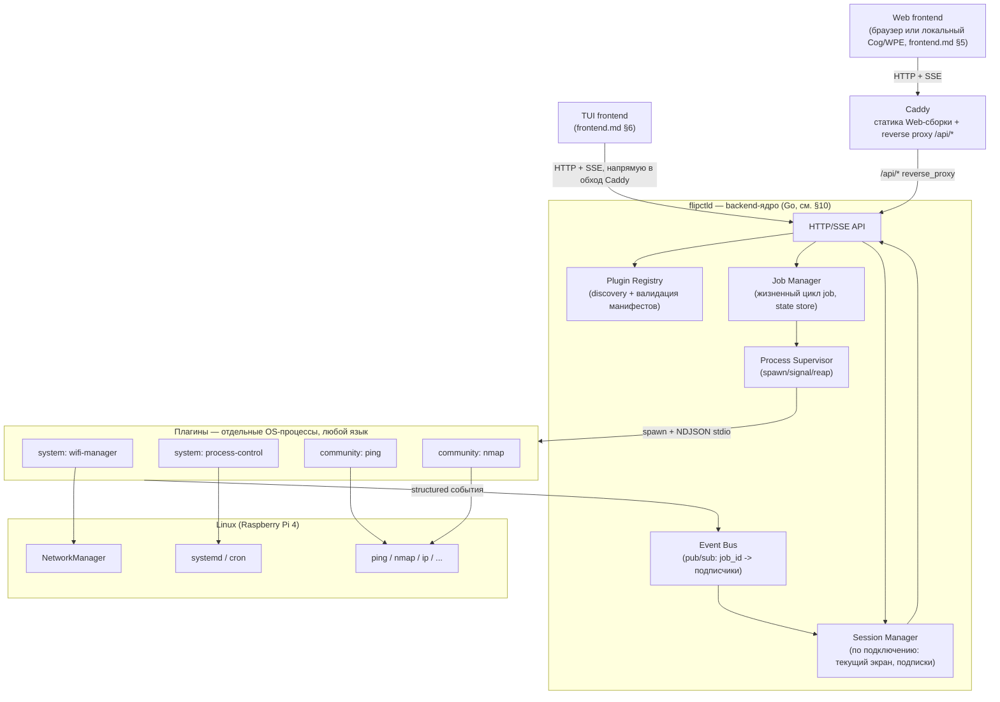
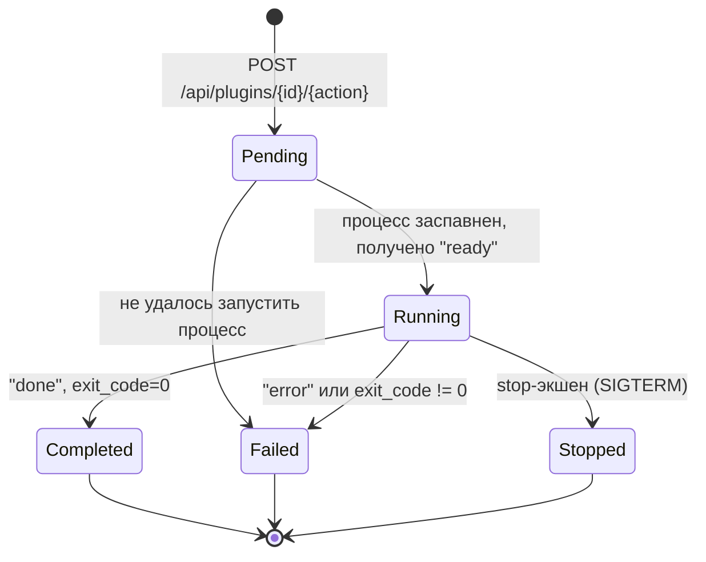
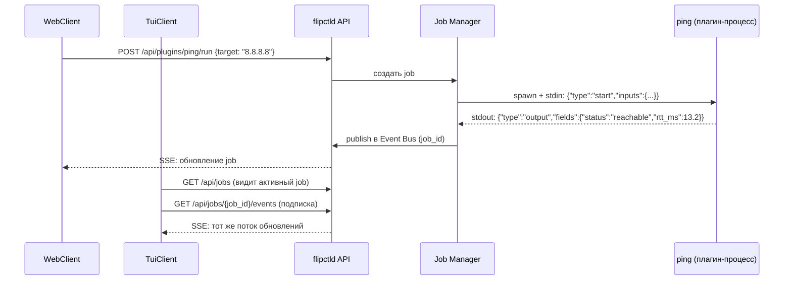
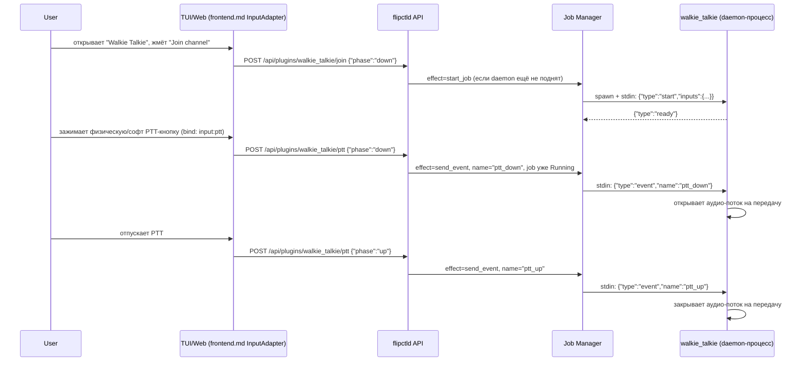

# FlipCTL — архитектура Backend и системы плагинов (предложение)

> Цель всего проекта FlipCTL: дать удобный способ пользоваться инструментами Linux (сетевые утилиты, systemd, управление процессами и т.д.) через интерфейс маленького экрана — будь то физическая панель, TUI по SSH или веб-страница. Backend — это та часть системы, которая знает, как разговаривать с Linux, и решает, что из этого разговора показать наружу.

> Область документа: **Backend** и **система плагинов** из общей схемы FlipCTL (см. `README.md`). Компаньон-документ — [`frontend.md`](./frontend.md), где спроектированы Web/TUI рендереры и API-контракт, который backend обязан реализовать (в частности `GET /api/registry` из frontend.md §4.2). В отличие от frontend.md, здесь backend больше не чёрный ящик — этот документ описывает, чем в итоге станет `server.js`. Пакетный менеджер для установки/обновления плагинов — вне скоупа; здесь описан только запуск и работа уже присутствующих на диске плагинов.

---

## 1. Почему `server.js` не масштабируется

Сегодняшний `server.js` (см. анализ в `frontend.md`) — это один файл на ~5000 строк, где на каждую системную возможность (Wi-Fi, Ethernet, звук, LED, power) написан свой HTTP-хендлер, который спавнит нужную Linux-утилиту и **сам** парсит её текстовый вывод регулярками. Это работает как proof of concept, но не масштабируется:

| Проблема `server.js` | Последствие |
|---|---|
| Вся логика в одном процессе/файле | Добавление новой возможности = правка центрального файла, растущего без границ |
| Парсинг вывода утилит живёт в самом сервере | Автор новой интеграции обязан лезть в код сервера и знать его конвенции |
| Нет изоляции между функциями | Падение/зависание одного парсера потенциально роняет весь backend |
| Нет модели "что сейчас выполняется" | Нельзя показать пользователю список активных операций, нельзя корректно остановить долгую операцию |
| Не предполагает несколько одновременных клиентов | Concurrency ничем не ограничена и ничем не управляется — просто "как получится" |
| Нет разделения "мы написали" / "сообщество написало" | Любое расширение делается тем же способом, что и системный код |

Это ровно те пункты, которые ниже становятся требованиями к новой архитектуре.

---

## 2. Ключевые решения

1. **Backend-ядро (`flipctld`) — тонкий генерик-супервизор, не хранилище бизнес-логики.** Все "интеграции с Linux" (Wi-Fi, ping, nmap, LED, cron, power) реализуются как **плагины** — отдельные процессы, которые ядро запускает и с которыми говорит по фиксированному протоколу. Ядро не знает, что такое `nmap`; оно знает, как спавнить процесс, слать ему структурированные сообщения и получать структурированные события обратно.
2. **Изоляция плагинов — отдельные OS-процессы.** Каждый плагин, системный или community, исполняется как независимый процесс, общающийся с ядром по IPC-протоколу (раздел 5). Это даёт: свободу выбора языка автору плагина (единственное требование — уметь читать/писать JSON через stdin/stdout, что умеет любой язык), устойчивость (падение плагина не роняет ядро), и естественную точку для будущей песочницы (раздел 12) — сегодня все плагины равнодоверенные, но граница для privilege-разделения уже проведена архитектурно, именно на уровне процесса.
3. **Backend поддерживает несколько одновременно подключённых UI-клиентов с общим видимым состоянием.** Если кто-то на Web запустил `nmap`-скан, кто-то параллельно на TUI по SSH должен видеть, что скан идёт, и подключиться к его выводу. Состояние job'ов — не привязано к клиенту, оно живёт в ядре; клиенты — подписчики (раздел 6).
4. **Модель привилегий/песочницы для плагинов — осознанно отложена.** Все плагины сейчас запускаются с одним уровнем доверия. Деление на `tier: system | community` в манифесте (раздел 4) фиксируется уже сейчас как метаданные, но **не влияет на исполнение** — только на группировку в UI и на будущее (раздел 12, там же — явный security-риск текущего решения).
5. **Стек ядра — Go.** Решение зафиксировано: Go — основной инструмент для `flipctld` (супервизор процессов + HTTP/SSE API — ровно та ниша, где у Go прямой прецедент: Docker, Kubernetes, HashiCorp-стек). Сравнение с Rust остаётся в разделе 10 как задокументированный concern/TBD — не потому что решение под вопросом, а потому что смена стека остаётся дешёвой: архитектура спроектирована так, чтобы почти не зависеть от языка ядра (границы — процессы и JSON по stdio, а не разделяемая память/FFI).
6. **Раздача Web-статики и внешний вход — отдельно от `flipctld`, через Caddy.** `flipctld` остаётся только API-сервером (плагины/job'ы), не хостингом фронтенда. Перед ним стоит `Caddy` (раздел 3.1) — раздаёт собранный Web-бандл как статику и проксирует `/api/*` на `flipctld`. Осознанная цена — второй резидентный процесс на RPi4, что формально противоречит теме экономии ресурсов из `frontend.md §1` — принято ради низкого порога входа (Caddyfile из нескольких строк, TLS/auth почти бесплатно в будущем) и полностью независимого цикла сборки/релиза Web-фронтенда от backend-бинарника. Альтернатива (раздавать статику самим `flipctld`, без отдельного процесса) остаётся дешёвым путём отступления, если экономия ресурса перевесит удобство — не архитектурный тупик, а конфигурационное изменение.

---

## 3. Архитектура верхнего уровня



`flipctld` — единственный резидентный процесс ядра (аналог сегодняшнего `server.js`, но без бизнес-логики внутри и без обязанностей веб-сервера). Он же отдаёт весь API, описанный в `frontend.md` (`GET /api/registry` и далее). Раздачу Web-статики и внешний вход берёт на себя `Caddy` — раздел 3.1.

### 3.1 Caddy — точка входа для Web

`Caddy` — единственный процесс, который слушает "внешний" HTTP-порт (и локально для Cog/WPE, и для браузера снаружи, если устройство доступно по сети). У него ровно две задачи, обе — конфигурация, не код:

```
:80 {
    handle /api/* {
        reverse_proxy localhost:8899
    }
    handle {
        root * /usr/share/flipctl/web
        file_server
    }
}
```

- **Раздать собранный Web-бандл** (`web/apps/web/dist` после `vite build`, `frontend.md §10`) как статику — Caddy не знает и не должен знать, что внутри, это просто файлы.
- **Проксировать `/api/*` на `flipctld`** — с точки зрения Web-кода (`fetch('/api/registry')`) ничего не меняется, Caddy прозрачен для контракта из `contract/openapi.yaml`.

**Cog/WPE указывает на Caddy, а не напрямую на `flipctld`** (`cog http://localhost:80/`) — локальный kiosk и внешний браузер проходят через одну и ту же точку входа, без специального случая для локального клиента.

**TUI обходит Caddy** и обращается к `flipctld` напрямую (`frontend.md §6.4`) — ему не нужна раздача статики, а лишний прокси-хоп не даёт никакой выгоды для нативного клиента. Единственная точка входа — это свойство Web-доступа, не универсальное требование ко всем клиентам.

Если в будущем экономия ресурса на RPi4 перевесит удобство отдельного процесса — миграция на раздачу статики самим `flipctld` (без Caddy) требует переноса содержимого `Caddyfile` в пару строк Go-кода, не переделки архитектуры.

---

## 4. Плагины

### 4.1 Манифест

Каждый плагин — директория с манифестом (`manifest.toml`) и точкой входа (исполняемый файл на любом языке). Манифест описывает и то, что нужно `flipctld` (как запускать, какие поля ожидать), и то, что нужно frontend'у (как рисовать — проекция в `frontend.md §4.2`).

```toml
# plugins/community/ping/manifest.toml
id = "ping"
title = "Ping"
version = "0.1.0"
icon = "network-ping"
category = "diagnostics"

tier = "community"          # "system" | "community" — метаданные, не влияет на исполнение (§2.4)
execution = "stream"        # "one-shot" | "stream" | "daemon" — см. §4.2
ui_kind = "generic"         # "custom" | "generic" — проекция в GET /api/registry (frontend.md §4.2)

entrypoint = "bin/ping-plugin"   # относительно директории плагина, любой рантайм

[permissions]                     # ЗАЯВЛЕНО, пока НЕ ПРИНУЖДАЕТСЯ (см. риски §12)
declared = ["network.raw_socket"]

[[inputs]]                        # что пользователь настраивает перед/во время запуска
id = "target"
label = "Target"
type = "text"
required = true

[[inputs]]
id = "interval"
label = "Interval"
type = "select"
options = ["1s", "5s", "continuous"]
default = "1s"

[[actions]]                       # что дёргает UI (кнопки/soft-buttons) — подробнее §4.4
id = "run"
label = "Run"
bind = "slot:2"                   # позиция в софт-кнопочной панели экрана
on_press = { effect = "start_job" }

[[actions]]
id = "stop"
label = "Stop"
bind = "slot:4"
on_press = { effect = "stop_job" }

[[outputs]]                       # структура полей, которые плагин будет присылать (§5)
id = "status"
label = "Status"
type = "text"

[[outputs]]
id = "rtt_ms"
label = "RTT"
type = "number"

[[outputs]]
id = "log"
label = "Log"
type = "list"
```

`inputs`/`outputs`/`actions` — это ровно то, что позволяет автору плагина, по формулировке из обсуждения, "вернуть список параметров для dropdown 2" или "вставить строку в поле 1": типы полей (`text`, `number`, `select`, `list`, в будущем — `table`) — это примитивы, которые уже есть или появятся в UI Kit обоих frontend'ов (`frontend.md` разделы 5-6). Манифест не рисует UI сам — он лишь размечает данные по этим примитивам; конкретную раскладку/иконки/стили определяет frontend, как и раньше.

Схема `kind: "generic"` в `frontend.md §4.2` расширена под `inputs`/`select`/`list` — теперь один и тот же пример плагина (`ping`) с одними и теми же полями фигурирует в обоих документах без расхождений.

### 4.2 Три оси классификации плагина

Манифест описывает плагин сразу по трём независимым осям — важно не путать их:

| Ось | Значения | Что определяет |
|---|---|---|
| **`tier`** (доверие) | `system` \| `community` | Кто отвечает за качество/обязательность (§2.4); в будущем — уровень привилегий/песочницы. Сегодня не влияет на исполнение. |
| **`execution`** (модель выполнения) | `one-shot` \| `stream` \| `daemon` | Как ведёт себя job (§4.3), как долго живёт процесс. |
| **`ui_kind`** (представление) | `custom` \| `generic` | Рисует ли UI собственный экран (Wi-Fi, Ethernet) или использует общий `GenericActionScreen`/`generic_action.rs` (`frontend.md §4.2/§6.2`). |

Пример: `wifi-manager` — `tier: system`, `execution: daemon` (следит за состоянием радиоинтерфейса постоянно), `ui_kind: custom` (у Wi-Fi сложный экран со списком сетей и вводом пароля). `ping` — `tier: community`, `execution: stream`, `ui_kind: generic`.

### 4.3 Execution-модели и Job

- **`one-shot`** — процесс запускается, делает свою работу, эмиттит один финальный результат, завершается. Пример: разовая проверка `df` (диск), `iperf`-тест. Job переходит `Running → Completed` автоматически по получении `done`.
- **`stream`** — процесс живёт, пока идёт операция, и постоянно шлёт события. Пример: `ping` (пока не остановят), захват трафика, длинный `nmap`-скан с прогрессом. Job переходит в `Completed`/`Stopped` по явному сигналу или естественному завершению процесса.
- **`daemon`** — процесс запускается **вместе с `flipctld`** (не по запросу конкретного экрана) и живёт постоянно, независимо от того, смотрит ли на него сейчас какой-то клиент. Пример: контроллер сетевых LED, обработчик кнопки Power. Такие плагины не создают "job" в обычном смысле — они регистрируют себя и живут как системный сервис под присмотром Process Supervisor, автоматически перезапускаясь при падении.

### 4.4 Софт-кнопки: как нажатие превращается в событие внутри плагина

Устройство (и в Web, и в TUI, и на физической панели) имеет ограниченный набор софт-кнопок под экраном — тот самый button bar на 5 слотов из `fake-flipctl2`. Плагин должен уметь: (а) дать этим кнопкам свои подписи, (б) решить, что происходит по нажатию/отпусканию, и (в) для уже запущенного процесса — получить это как **событие**, а не как повторный запуск с нуля. Именно поэтому `[[actions]]` — это не просто "кнопка → HTTP-эндпоинт", а декларация с тремя частями:

- **`bind`** — за какую кнопку отвечает action:
  - `slot:0..4` — конкретная позиция в софт-кнопочной панели текущего экрана плагина (нумерация как в существующей 5-слотовой панели `fake-flipctl2`). Если `bind` не указан — frontend раскладывает action в первый свободный слот по порядку объявления в манифесте.
  - `input:<name>` — привязка не к конкретному слоту, а к **универсальному** семантическому действию из `input-actions` контракта (`frontend.md §4.1`), например `input:ptt`. Такие действия уже зашиты в UI как физические/зарезервированные (Ptt — ровно тот случай из прототипа `walkie_talkie.js`), и плагин просто подписывается на уже существующую кнопку, не занимая один из 5 слотов.
- **`on_press`/`on_release`** — реакция на нажатие и на отпускание раздельно (нужно для push-to-talk и любого "зажми и держи"). Если `on_release` не указан — отпускание игнорируется, кнопка ведёт себя как обычный тап.
- **`effect`** внутри `on_press`/`on_release` — что конкретно происходит:
  - `start_job` — создать job (как раньше — единственный вариант в первой версии документа).
  - `stop_job` — сигнал `SIGTERM` активному job'у плагина (как раньше).
  - `send_event` — **новое**: если job уже `Running`, отправить именованное событие в его stdin (раздел 5), не трогая жизненный цикл процесса. Если активного job'а нет — no-op с ошибкой в ответе (см. риски §12).

Пример — `walkie_talkie` (`tier: system`, `execution: daemon`, `ui_kind: custom`, прямой аналог `fake-flipctl2/js/apps/walkie_talkie.js`):

```toml
[[actions]]
id = "join"
label = "Join channel"
bind = "slot:2"
on_press = { effect = "start_job" }   # поднимает аудио-daemon, если ещё не поднят

[[actions]]
id = "ptt"
label = "Talk"
bind = "input:ptt"                     # универсальная физическая PTT-кнопка, не слот
on_press   = { effect = "send_event", name = "ptt_down" }
on_release = { effect = "send_event", name = "ptt_up" }
```

Здесь `join` один раз стартует долгоживущий процесс (если он ещё не поднят другим клиентом — job общий, multi-client §6), а каждое нажатие/отпускание PTT не создаёт новый процесс, а лишь кормит событиями уже бегущий — что и требуется для живого аудио-потока.

> Технический долг между документами: слот-панель (`slot:0..4`) сегодня нигде явно не формализована в `frontend.md` как отдельный примитив UI Kit — там есть виджеты-кнопки, но не декларативная "панель на N подписанных слотов, управляемая данными снаружи". Нужно добавить такой примитив в `frontend.md` разделы 5-6 (см. также раздел 11 ниже).

### 4.5 System-плагины и D-Bus: не спавнить CLI, а звать сервис напрямую

Протокол `flipctld` ↔ плагин (NDJSON поверх stdio, раздел 5) не меняется — он и дальше самый низкий барьер входа для любого языка. Но **внутри** `tier: system` плагина, который оборачивает подсистему ОС, есть неправильный и правильный способ это делать:

- **Неправильно** (повторяет проблему `server.js` из раздела 1): плагин спавнит `nmcli`/`systemctl` как дочерний процесс и парсит его текстовый stdout регулярками.
- **Правильно**: `NetworkManager`, `systemd`, `logind`/`UPower` (питание/батарея), `BlueZ` — уже сами являются D-Bus-сервисами (`org.freedesktop.NetworkManager`, `org.freedesktop.systemd1`, ...) с типизированными методами и **сигналами** изменения состояния. Плагин держит внутри себя обычный D-Bus-клиент (`dbus-python`, `zbus`/`dbus-rs`, `godbus`, `dbus-next` — под любой язык есть библиотека) и вызывает методы/подписывается на сигналы напрямую — никакого парсинга текста, никакого поллинга (подписка на `PropertiesChanged` вместо опроса раз в секунду).

Для `flipctld` это полностью прозрачно: снаружи плагин по-прежнему просто шлёт NDJSON в stdout, как любой другой. D-Bus — деталь реализации конкретного `tier: system` плагина, а не часть протокола ядра. Рекомендация, а не требование: community-плагин, оборачивающий `ping`/`nmap`, D-Bus не касается вообще — там как раз уместно оставаться на уровне "просто спавни утилиту", у CLI-утилиты нет D-Bus API.

Автору `tier: system` плагина не нужно исследовать D-Bus API NetworkManager/systemd с нуля — это задокументированный, стабильный протокол с готовыми клиентскими библиотеками под большинство языков: `libnm`/`python-networkmanager` (Python), `zbus` (Rust), `godbus` (Go), `dbus-next` (Node). Официальные `nmcli`/`nmtui` от самого NetworkManager — не код для переиспользования (это отдельные full-screen программы, не встраиваются в наш Navigator/Screen-стек), но хороший референс по составу возможностей, которые стоит покрыть в собственном Wi-Fi-экране (список сетей, подключение, забыть сеть, hotspot).

---

## 5. IPC-протокол: NDJSON поверх stdio

Простейший протокол, не требующий от автора плагина ничего, кроме умения писать в stdout и читать stdin — работает одинаково в Bash+`jq`, Python, Node, Go, Rust, чём угодно.

**Ядро → плагин** (stdin). Для `one-shot`/`stream` — одна стартовая строка при спавне; для `stream`/`daemon` stdin **остаётся открытым на всё время жизни процесса** — именно через него прилетают события от софт-кнопок (раздел 4.4), а не только стартовые параметры:

```json
{"type":"start","inputs":{"target":"8.8.8.8","interval":"1s"}}
{"type":"event","name":"ptt_down"}
{"type":"event","name":"ptt_up"}
```

**Плагин → ядро** (stdout, поток NDJSON-строк):

```json
{"type":"ready"}
{"type":"output","fields":{"status":"reachable","rtt_ms":13.2}}
{"type":"log","line":"64 bytes from 8.8.8.8: icmp_seq=1 ttl=117 time=13.2 ms"}
{"type":"done","exit_code":0}
{"type":"error","message":"host unreachable"}
```

- `output` — обновляет текущее состояние job'а полями, объявленными в `outputs` манифеста. Это то, что видят подписанные клиенты и что отдаётся в `GET /api/jobs/{id}`.
- `log` — сырая строка для истории/дебага, не обязана маппиться в конкретное UI-поле.
- `done`/`error` — терминальные состояния job'а.
- `event` (ядро → плагин) — то, во что превращается нажатие/отпускание софт-кнопки с `effect: send_event` (раздел 4.4). Плагин сам решает, что с этим делать (например, размонтировать/примонтировать аудио-поток при `ptt_down`/`ptt_up`) — ядро лишь доставляет именованное событие, не интерпретируя его.
- Остановка (`stop_job`-эффект) для PoC не требует отдельного протокольного сообщения — ядро просто посылает `SIGTERM` (с эскалацией до `SIGKILL` по таймауту) процессу job'а. Плагин может дополнительно слушать `{"type":"stop"}` на stdin для graceful-остановки — опционально, не обязательно для PoC.

Автор плагина, таким образом, пишет "бизнес-логику поверх существующей Linux-утилиты" ровно в том смысле, как это описано в обсуждении: сам вызывает `ping`/`nmap` любым удобным способом, сам парсит их вывод (это его ответственность, не ядра — прямое исправление проблемы `server.js` из раздела 1), и отдаёт наружу уже структурированный, размеченный по `outputs` результат.

---

## 6. Job / Session / Event Bus



- **Job** — состояние одного выполнения плагин-экшена: `id`, `plugin_id`, `inputs`, текущие `outputs`, статус, время старта. Для PoC — упрощающее допущение: **один активный job на plugin id одновременно** (второй `run` для уже бегущего `ping` — ошибка или неявный рестарт, не параллельные job'ы). Явно ограничивает scope, снято в будущем при необходимости (раздел 12).
- **Session** — состояние одного подключённого клиента: `connection_id`, текущий открытый экран (`current_screen_id` — это и есть "screens/views" из обсуждения), список job'ов, на которые подписан. Используется, чтобы не слать SSE-события клиенту, который сейчас смотрит на другой экран, и чтобы решать, какие `daemon`/`stream` job'ы стоит держать активными (если это уместно для конкретного плагина).
- **Event Bus** — внутренний pub/sub: каждое `output`/`log`/`done`/`error` от плагина публикуется по ключу `job_id`; `Session Manager` доставляет их всем клиентам, подписанным на этот `job_id`, через SSE. Job — общий для всех клиентов (multi-client-требование §2.3): кто угодно может подписаться на уже бегущий job, а не только тот, кто его запустил.



---

## 7. HTTP/SSE API — контракт для frontend

Продолжение `api-contract` из `frontend.md §4.3`/§9, теперь полностью специфицированное:

| Метод | Путь | Назначение |
|---|---|---|
| `GET` | `/api/registry` | Список приложений/плагинов (`frontend.md §4.2`), проекция манифестов |
| `POST` | `/api/plugins/{id}/{action}` | Выполнить action манифеста. Тело `{"phase": "down" \| "up"}` выбирает `on_press`/`on_release` из манифеста (раздел 4.4); эффект — `start_job`/`stop_job`/`send_event`. Отвечает `{"job_id": "..."}` для start, `{}` для остальных |
| `GET` | `/api/plugins/{id}/status` | Дешёвое синхронное чтение последнего состояния — для простых всегда-живых `system`/`daemon` плагинов (Wi-Fi, Power), без создания job |
| `GET` | `/api/jobs` | Список активных job'ов across всех клиентов (аналог App Switcher из `frontend.md`, но на уровне backend) |
| `GET` | `/api/jobs/{job_id}` | Снапшот текущего состояния job'а |
| `GET` | `/api/jobs/{job_id}/events` | SSE-поток структурированных событий job'а |

И Web (`fetch`/`EventSource`), и TUI (`ureq`/`reqwest` + SSE-парсинг) обращаются к этому API одинаково — ровно так, как уже спроектировано в `frontend.md` разделах 5 и 6.4.

---

## 8. Discovery плагинов (без пакетного менеджера)

Пакетный менеджер — вне скоупа, но загрузка уже присутствующих на диске плагинов должна быть определена:

```
/usr/lib/flipctl/plugins/system/<id>/manifest.toml   # мы пишем и поставляем
/etc/flipctl/plugins/<id>/manifest.toml               # community, устанавливается вручную/будущим менеджером
```

При старте `flipctld` сканирует оба каталога, валидирует манифесты по формальной схеме — `contract/manifest.schema.json` (JSON Schema, draft 2020-12; манифест валидируется по своему TOML→JSON представлению) — и строит in-memory `Plugin Registry`, которая и отдаётся через `GET /api/registry` (форма ответа — `contract/openapi.yaml`, схема `RegistryEntry`). Плагин с невалидным манифестом логируется и пропускается, не блокируя старт остальных (единственная точка отказа не должна ронять весь backend — тот же принцип изоляции, что и на уровне процессов).

---

## 9. Примеры: end-to-end

### 9.1 `ping` — start/stop job, разные клиенты видят один поток

1. `flipctld` стартует, сканирует `/etc/flipctl/plugins/ping/manifest.toml`, добавляет в registry с `ui_kind: "generic"`.
2. Web/TUI запрашивают `GET /api/registry`, получают карточку "Ping" в общем списке приложений, рендерят её через `GenericActionScreen`/`generic_action.rs` — ни строчки кода под конкретно ping не потребовалось.
3. Пользователь на Web открывает "Ping", вводит `target = 8.8.8.8`, жмёт "Run" (`bind: slot:2`, `on_press: {effect: start_job}`) → `POST /api/plugins/ping/run {"phase":"down"}`.
4. `flipctld` спавнит `bin/ping-plugin`, шлёт `{"type":"start","inputs":{"target":"8.8.8.8","interval":"1s"}}` на stdin.
5. `ping-plugin` (например, простой Python-скрипт вокруг системного `ping`) сам зовёт `ping -i 1 8.8.8.8`, парсит его построчный вывод, эмиттит `output`-события с полями `status`/`rtt_ms`, дублирует сырые строки как `log`.
6. `flipctld` публикует события в Event Bus по `job_id`; Web получает их по уже открытому SSE.
7. Пользователь на TUI по SSH параллельно открывает тот же "Ping" — видит в `GET /api/jobs`, что job уже бежит, подписывается на `/api/jobs/{job_id}/events`, видит тот же самый живой RTT.
8. Пользователь на Web жмёт "Stop" → `POST /api/plugins/ping/stop` → `flipctld` шлёт `SIGTERM` процессу job'а → `ping-plugin` завершается → `done` → job `Stopped` → оба клиента видят финальное состояние.

### 9.2 `walkie_talkie` — событие в уже запущенный процесс (push-to-talk)

В отличие от `ping`, здесь нажатие кнопки не должно порождать новый процесс — оно должно достучаться до уже работающего аудио-daemon'а. Это ровно случай `effect: send_event` из раздела 4.4.



Ключевое отличие от 9.1: между `join` и `ptt` — один и тот же job (`plugin_id = "walkie_talkie"`), `ptt` не создаёт новых процессов и не идёт через `Pending`/`Completed` — это просто доставка события в уже открытый stdin.

---

## 10. Стек: Go (Rust — задокументированный concern/TBD)

**Решение: Go — основной инструмент для `flipctld`.** Таблица ниже сохраняется не как открытый вопрос, а как зафиксированный повод для пересмотра в будущем — если появится конкретная причина (например, реальная потребность в общих типах с TUI, раздел 11.1), к сравнению можно будет вернуться предметно, а не абстрактно.

| | Go (выбрано) | Rust (concern/TBD) |
|---|---|---|
| Прецеденты именно для "супервизор процессов + plugin system + API" | Docker, Kubernetes, HashiCorp (Nomad/Consul/Vault) | Меньше прямых прецедентов именно в этой нише |
| Конкурентность (много job'ов, много подписчиков) | Goroutines/channels — низкий порог входа | `tokio` — сопоставимо по возможностям, выше порог входа |
| Порог входа для контрибьюторов ядра (не самих плагинов — плагины на любом языке в любом случае) | Ниже | Выше |
| Синергия с TUI-фронтендом (`frontend.md §6` — Rust/`ratatui`) | Языки не совпадают — принято как есть, раздел 11.1 | Совпадал бы с TUI → общий crate для api-contract типов, автогенерация TS-типов через `ts-rs`/`specta` для Web |
| Резидентный footprint на RPi4 | Малый (статический бинарник, GC чуть тяжелее Rust, но заметно легче Node) | Минимальный |

Единственное реальное последствие этого выбора — TUI (`frontend.md`) остаётся на Rust, а backend-ядро на Go: языки не совпадают, бонус "общих типов контракта" не достигается автоматически. Решено принять это как есть (раздел 11.1) — при текущем размере `api-contract` ручная синхронизация дешевле, чем пересмотр уже закрытого выбора TUI-стека.

### Структура репозитория (Go)

```
flipctld/
├── cmd/flipctld/              # main, старт HTTP/SSE сервера
├── internal/registry/         # discovery + валидация манифестов
├── internal/supervisor/       # spawn/signal/reap процессов плагинов
├── internal/jobs/             # Job Manager, state store, IPC-кодек (NDJSON)
├── internal/eventbus/         # pub/sub job_id -> подписчики
├── internal/session/          # Session Manager (per-connection)
├── internal/api/              # HTTP handlers + SSE
└── plugins/
    ├── system/                # мы пишем и поставляем: wifi, power, process-control, cron, ...
    └── community/              # ping, nmap, ... (только для локальной разработки/примеров)
```

Рядом, вне дерева `flipctld` (отдельный процесс, раздел 3.1) — `deploy/Caddyfile`, конфигурация, не код.

---

## 11. Связь с `frontend.md`

| Что | `frontend.md` предполагал | `backend.md` теперь специфицирует |
|---|---|---|
| `GET /api/registry` | Обязательный новый backend-эндпоинт, форма ответа с `kind: custom\|generic` | Реализован как проекция `Plugin Registry` (раздел 8); поле `kind` в ответе = поле `ui_kind` манифеста (раздел 4.2) |
| `/api/plugins/{id}/{action}` | Упомянут в примере generic-схемы как endpoint экшена | Полностью специфицирован (раздел 7): создаёт/сигналит Job, возвращает `job_id` |
| "Существующие `/api/wifi`, `/api/power`, ..." (раздел 3 `frontend.md`, помечены как неизменяемый чёрный ящик) | Черный ящик, не в скоупе | Больше не чёрный ящик: становятся `tier: system`-плагинами (`wifi-manager`, `power`) с `ui_kind: custom`, доступными через `/api/plugins/{id}/status` для дешёвого чтения — сам факт существования этих HTTP-путей сохраняется, реализация под ними меняется полностью |
| Иконки/семантические имена в реестре | Резолвятся Web в спрайт, TUI — в текстовый лейбл | Источник поля `icon` в реестре — манифест плагина (раздел 4.1), без изменений в модели |
| Софт-кнопки экрана (5-слотовая панель `fake-flipctl2`) | Упомянуты как виджеты (`LeftButton`/`MiddleButton`/`RightButton` в UI Kit), но без декларативного механизма "кем управляется каждый слот" | Полностью специфицирован манифестом (раздел 4.4): `bind: slot:0..4 \| input:<name>`, `on_press`/`on_release`. Требует нового примитива в UI Kit `frontend.md` — панель, управляемая данными реестра, а не хардкодом экрана |

`frontend.md` в шапке сейчас описывает backend как "чёрный ящик... не меняется" — это верно относительно API-контракта (frontend не должен ничего переписывать), но не относительно реализации backend, которая теперь полностью пересматривается этим документом. Стоит поправить формулировку в шапке `frontend.md`, чтобы не создавать впечатление, будто backend вообще не в работе — сделано отдельным небольшим правкой вслед за этим документом.

### 11.1 Решено: TUI на Rust, backend на Go — разные языки, принято как есть

Backend (Go, раздел 10) и TUI (Rust/`ratatui`, `frontend.md §6`) остаются разными языками — решение TUI-стека не пересматривается. `api-contract` (`frontend.md §4.3`) продолжает поддерживаться вручную в обе стороны, как и было изначально спроектировано (риск уже описан в `frontend.md §11`, ничего не меняется по существу).

Если ручная синхронизация станет реальной проблемой (а не гипотетическим риском) — самый дешёвый путь исправить это, не трогая ни один из двух языковых выборов: описать `api-contract` единой языконезависимой схемой (JSON Schema/OpenAPI) и генерировать из неё Go-структуры, Rust-структуры и TS-типы кодогенератором. Это не требуется сейчас — размер контракта (`GET /api/registry`, `/api/plugins/*`, `/api/jobs/*`) пока небольшой, ручной синхронизации достаточно.

---

## 12. Риски и открытые вопросы

- **Привилегии `flipctld` и unsandboxed community-плагины — самый серьёзный текущий пробел.** Если ядро запускается с правами, достаточными для системных плагинов (управление NetworkManager/systemd часто требует root или конкретных capabilities), а community-плагины спавнятся тем же ядром без понижения прав — community-плагин по умолчанию получает те же привилегии. Это осознанно отложено (§2.4) до появления реальных community-плагинов, но **это дыра, а не нейтральная недоработка**. Конкретный кандидат на решение, а не абстрактное "продумать" — тот же двухслойный стек, которым реально пользуются сами NetworkManager/systemd: **D-Bus system bus policy** (`/etc/dbus-1/system.d/*.conf`) — грубый фильтр уровня шины ("может ли этот UID вообще слать сообщения этому сервису"), и поверх него **polkit** (`org.freedesktop.PolicyKit1`) — тонкая авторизация конкретного действия для конкретного вызывающего (например "разрешить читать статус Wi-Fi всем, но менять системный профиль сети — только доверенным"). Работает это только если у каждого плагина — свой узнаваемый вызывающий: то есть напрямую зависит от того, чтобы плагин сам был D-Bus-клиентом со своей идентичностью (раздел 4.5), а не чтобы `flipctld` проксировал D-Bus-вызовы от имени всех плагинов одним и тем же процессом — иначе polkit увидит везде один и тот же UID `flipctld` и не сможет разграничить system/community. Отдельно остаётся вопрос "от чьего имени бежит сам процесс плагина" (`setuid`-обёртка / systemd `DynamicUser=`/`CapabilityBoundingSet=` per-plugin unit) — он и определяет, какую идентичность увидит polkit.
- **Ограничение "один активный job на plugin id"** (раздел 6) упрощает PoC, но не покрывает реалистичный сценарий "одновременно пинговать два хоста". Снятие ограничения — это переход от `job_id` по `plugin_id` к настоящему множественному instance-у, несложно, но не сделано сейчас осознанно.
- **Персистентность job'ов между рестартами `flipctld` не спроектирована** — состояние только in-memory. На embedded-устройстве, которое может перезагружаться, история/статус долгих операций (например, незавершённого nmap-скана) будет теряться. Для PoC это приемлемо; для прод-версии стоит сразу заложить, куда это писать (например, локальный sqlite-журнал).
- **Валидация манифестов — структура формализована, но не вся семантика.** `contract/manifest.schema.json` покрывает форму (обязательные поля, допустимые `type`/`enum` значения, условные требования вроде `options` при `type: select`). Проверка `bind`-конфликтов (два action одного плагина с одним и тем же `slot:N`) — это cross-item constraint, который обычная JSON Schema выражает плохо/громоздко; остаётся написать отдельной проверкой в коде `flipctld` при discovery (раздел 8), не в самой схеме.
- **SSE vs WebSocket для Event Bus — риск снят.** В первой версии документа это было открытым вопросом: "если понадобится слать команды в уже бегущий job — потребуется WebSocket". Раздел 4.4/5 решает это без WS: команды (`send_event`) идут обычным `POST` (направление клиент→backend и так всегда было запросным), а backend сам форвардит их в stdin процесса. SSE остаётся чисто однонаправленным (backend→клиент) и этого достаточно.
- **`send_event` в отсутствующий job.** Если пользователь жмёт `ptt`, а `walkie_talkie`-daemon почему-то не поднят (упал, ещё не был `join`-нут) — `POST` должен возвращать явную ошибку (например `409 Conflict` с сообщением "job not running"), а не молча теряться. Frontend должен уметь это показать (например, disabled-состояние кнопки, если по `GET /api/jobs` активного job'а для этого plugin_id нет) — сегодня это не специфицировано ни в одном документе.
- **Caddy — второй резидентный процесс на RPi4** (раздел 3.1), осознанно принятый ради низкого порога входа и независимого релиза Web-фронтенда — прямое отступление от темы экономии ресурсов, которая была причиной решений про Node/WASM в `frontend.md §1`. Не забыть: если это станет реальной, а не гипотетической проблемой (например, при явном дефиците RAM на слабых RPi4 1-2GB), путь назад — раздача статики самим `flipctld` — уже описан и дешёв, не требует пересмотра остальной архитектуры.
- **Периметр доступа Caddy не спроектирован.** Caddy — точка, где решается, слушает ли backend только `localhost`/LAN или буквально любой входящий трафик. Авторизация Web-доступа сознательно вынесена за скобки этой архитектуры как "проблема из будущего" — но именно Caddy станет тем местом, где она будет закрываться (TLS, basic auth, allowlist по сети), когда до неё дойдёт очередь.

---

## 13. Дорожная карта PoC

1. `flipctld`: HTTP-сервер + `Plugin Registry` (discovery, без валидации по формальной схеме) + статический `GET /api/registry` на 2-3 тестовых манифестах.
2. `Process Supervisor` + `Job Manager`: реализовать `one-shot`-путь целиком (spawn → NDJSON stdin/stdout → `done`) на одном реальном плагине (например `diskspace` — просто и без прав).
3. Добавить `stream`-путь + `Event Bus` + SSE (`/api/jobs/{id}/events`) — доказать multi-client сценарий (раздел 9, шаги 6-7) на `ping`.
4. Перевести один существующий `system`-путь из `server.js` (например Wi-Fi статус, `ui_kind: custom`) на новую модель — доказать, что `frontend.md`-контракт (`/api/plugins/wifi/status`) не потребовал изменений во frontend-коде.
5. `daemon`-путь на одном плагине без реального UI-триггера (например LED-контроллер) — доказать, что Process Supervisor умеет держать и рестартовать долгоживущие плагины отдельно от job-модели.
6. `Caddyfile` (раздел 3.1): статика Web-сборки + `reverse_proxy /api/*` на `flipctld` — доказать, что и локальный Cog, и внешний браузер попадают в один и тот же UI без разного конфигурирования клиентов.
