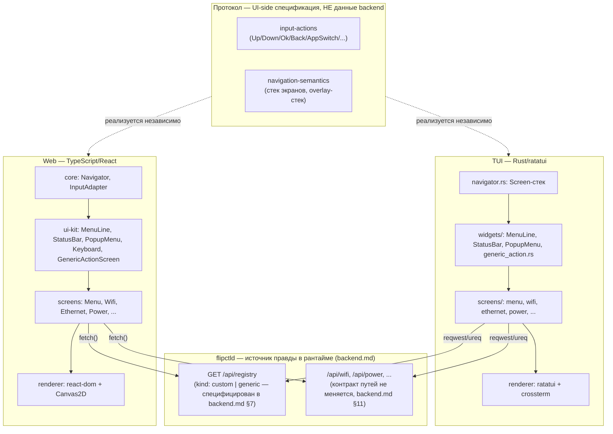
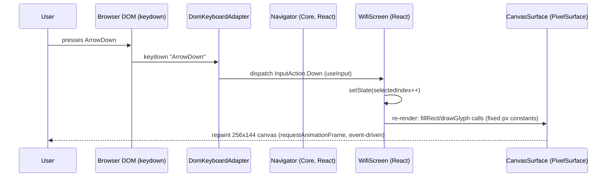
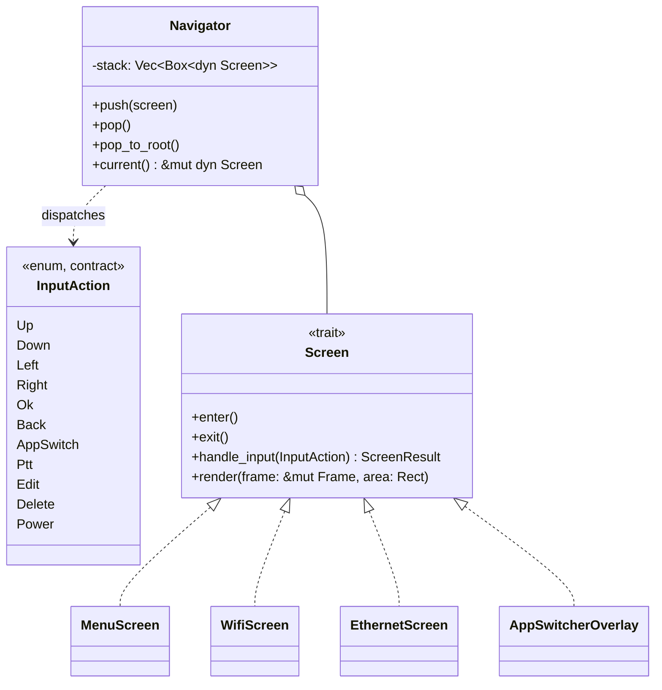
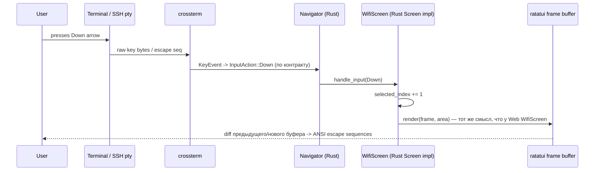
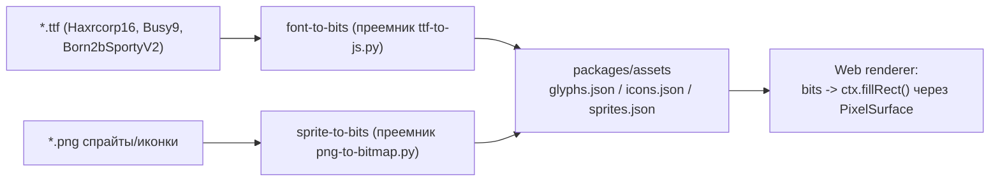

# FlipCTL — архитектура UI и Renderer-слоя (предложение)

> Область документа: только **UI Frontend** и **Renderer** из общей схемы FlipCTL (см. `README.md`). Backend спроектирован отдельно, в компаньон-документе [`backend.md`](./backend.md) — здесь важен только API-контракт, который он обязан предоставлять (в частности `GET /api/registry`, раздел 4.2), а не его внутреннее устройство. Целевые платформы PoC — **Web** и **TUI** (SSH/локальный терминал), с прицелом на будущий hardware/DRM-рендерер. Устройство — встраиваемый Linux-хост класса Raspberry Pi 4: ограниченная память, важна экономия CPU/батареи, лишние резидентные рантаймы — это реальная цена, а не абстрактный риск.

---

## 1. Постановка задачи и ограничения

Из `README.md`:

- UI сейчас — HTML/JS, рендерится headless WebKit (Cog) прямо на DRM, без Xorg/Wayland.
- Хотим несколько renderer-ов для одного UI: минимум Web и TUI, с прицелом на hardware-таргет в будущем.
- Web должен быть pixel-perfect: 1-bit/grayscale стиль экрана 256×144 (см. `fake-flipctl2`), кастомные bitmap-шрифты, спрайты.
- **TUI pixel-perfect не требуется.** Это не "тот же экран в текстовом виде", а полноценный текстовый интерфейс с собственной эстетикой терминала. Web и TUI должны быть узнаваемо одной и той же навигацией/структурой, но не обязаны совпадать визуально.
- Устройство — встраиваемое, с ограниченными ресурсами и вниманием к энергопотреблению. Лишний резидентный рантайм (JS-движок, WASM-runtime) на TUI-стороне — не бесплатная абстракция, а реальная статья расхода RAM/CPU/батареи, особенно если TUI поднимается интерактивно (SSH-сессия, локальный терминал).

Это прямо определяет ключевое архитектурное решение документа (раздел 2): отказ от идеи "одно React-дерево на оба таргета" в пользу двух независимых, платформенно-идиоматичных реализаций, связанных общим *контрактом*, а не общим *рантаймом*.

---

## 2. Ключевое решение: общий контракт, а не общее дерево компонентов

### 2.1 Рассмотренная и отклонённая альтернатива

Первая версия этого документа предлагала паттерн React Native/Ink/Dioxus: одно React-дерево, два React-reconciler-а (`react-dom` для Web, `@opentui/react` для TUI), общий Yoga-layout для согласования координат. У подхода есть зрелые прецеденты (React Native + react-native-web, Ink, Dioxus с TUI-рендерером через ratatui) — и он остаётся валидным выбором для проектов, где TUI тоже должен быть pixel-perfect или где на TUI-стороне уже гарантированно есть Node/Bun.

Причина отказа для FlipCTL конкретно:

1. TUI не обязан быть pixel-perfect → пропадает главный аргумент "рисовать оба через общий низкоуровневый canvas/cell-buffer API".
2. Требование к экономии ресурсов на встраиваемом устройстве делает Node/Bun/OpenTUI+Yoga(WASM) на TUI-стороне неоправданной ценой ради код-шеринга, который и так частичный (виджеты пришлось бы стилизовать по-разному под каждую платформу).
3. TUI и так проще по составу (текст, рамки, без спрайт-анимаций) — потеря код-шеринга именно здесь обходится дёшево.

### 2.2 Принятое решение

Два независимых, нативных для своей экосистемы стека:

- **Web:** React + `react-dom` + Canvas2D — как и раньше, для сохранения pixel-perfect 1-bit эстетики (раздел 5).
- **TUI:** **Rust + `ratatui`** — компилируемый, нативный, без JS-рантайма вообще (раздел 6).

Общим между ними является не код, а **контракт** — и контракт здесь неоднороден по своей природе. Часть его — это протокол, который придумывает и поддерживает сам UI-слой (какие бывают действия ввода, как устроен стек навигации). А часть — это **данные, которыми в рантайме владеет backend**: какие приложения/экраны вообще существуют в системе прямо сейчас, определяется не UI-репозиторием, а установленными на устройстве backend-плагинами (см. раздел 4.2). Обе UI-реализации не хранят список приложений у себя — они спрашивают его у backend при старте, как любые другие данные.



---

## 3. Что переносим из `fake-flipctl2`

| Модуль прототипа | Роль | Судьба |
|---|---|---|
| `js/canvas.js` (`FlipCanvas`) | Рисование пикселей/спрайтов/иконок в canvas | Логика растеризации портируется в Web `renderer` практически как есть (раздел 5). TUI её не использует. |
| `js/scene.js` (`SceneManager`) | Стек экранов: push/pop/enter/exit | Семантика фиксируется в `contract/navigation-semantics`; на Web реализуется как React `Navigator` (Context/reducer); на TUI — что приятный сюрприз — почти дословно ложится на идиоматичный Rust: `Vec<Box<dyn Screen>>` со стеком и трейтом `enter/exit/handle_input/render`. Оригинальный класс-based паттерн прототипа на самом деле ближе к Rust-стилю, чем к React. |
| `js/input.js` (`Input`, `KEY_MAP`) | Клавиша → семантическое действие | Семантика (`Up/Down/Left/Right/Ok/Back/AppSwitch/Ptt/Edit/Delete/Power`) фиксируется в `contract/input-actions`; на Web — `DomKeyboardAdapter` (`keydown`/`keyup`); на TUI — маппинг `crossterm::event::KeyEvent` → тот же enum на Rust. |
| `js/apps/*.js` (~30 сцен) | Экран = `{enter, exit, handleInput, render}` | На Web переписываются как React-компоненты. На TUI — как структуры, реализующие трейт `Screen`, в своём модуле `screens/`. |
| `js/component-library/*.js`, `js/ui.js` | MenuLine, ResponsiveFrame, PopupMenu, Keyboard, MessageBox, Scrollbar, TextInputBox/InputField | На Web переносятся как React-компоненты почти 1:1. На TUI — переиспользуется **нейминг и семантика** (свой `widgets/menu_line.rs` и т.д.), но реализация — идиоматичный `ratatui::widgets::Widget`/`StatefulWidget`, без визуального копирования пиксельного стиля. Виртуальная экранная `Keyboard` в TUI, скорее всего, **не нужна** — в терминале уже есть настоящая клавиатура (см. раздел 8). |
| `js/running_apps.js` | MRU-список открытых приложений, статический список сцен в `index.html` | Список приложений перестаёт быть чем-то, что живёт в UI-репозитории вообще. Он приходит от backend в рантайме (`GET /api/registry`, раздел 4.2) — MRU-список открытых окон (App Switcher) остаётся локальным UI-состоянием (что сейчас открыто), а *какие приложения в принципе бывают* — данные backend, отражающие установленные плагины. |
| `js/font.js`, `js/haxrcorp16.js`, `js/busy9.js`, `js/born2bsportyv2.js`, `js/icons.js`, `js/sprites.js`, `js/animated_icons.js` | Bit-packed данные шрифтов/иконок/спрайтов | Используются **только Web-рендерером** (раздел 7). TUI их не потребляет — иконки в терминале представлены короткими текстовыми лейблами/символами через отдельную небольшую таблицу соответствия `icon-id → &str`. |
| `ttf-to-js.py`, `png-to-bitmap.py` | Офлайн-конвертация TTF/PNG → JS | Остаются Web-only частью asset-пайплайна. |
| `server.js` (`/api/*`) | HTTP API поверх системных утилит | **Заменяется на `flipctld`** — полностью переосмыслен как супервизор плагинов, а не файл с хендлерами (см. `backend.md`). Контракт путей (`/api/*`) сохраняется, поэтому Web (`fetch`) и TUI (`reqwest`/`ureq`) обращаются к нему без изменений в своём коде. |

---

## 4. Контракт — что в нём осталось, и что теперь отдаёт backend

После пересмотра (раздел 4.2) контракт перестал быть однородным набором файлов в UI-репозитории. Теперь это два принципиально разных источника правды.

### 4.1 Протокол — по-прежнему UI-side спецификация

То, что backend в принципе не касается — семантика взаимодействия с интерфейсом, а не предметная область системы:

- **`input-actions`** — enum из ~11 значений (`Up/Down/Left/Right/Ok/Back/AppSwitch/Ptt/Edit/Delete/Power`). Backend не может знать, что означает нажатие физической кнопки или клавиши стрелки — это исключительно про то, как Web и TUI интерпретируют ввод.
- **`navigation-semantics`** — модель стека экранов (push/pop/popToRoot, отдельный overlay-стек для попапов/App Switcher).

Обе спецификации небольшие, стабильные, меняются редко — документируются как markdown-спецификация и реализуются независимо (TS-enum на Web, Rust-enum на TUI), без общего файла-данных, потому что шарить, по сути, нечего — это не данные, а поведение.

### 4.2 App Registry — данные времени выполнения, источник правды — backend

Ключевая поправка этого раздела: **список приложений/экранов не хранится в UI-репозитории вообще**, ни как статический файл, ни как build-time константа. Он приходит от backend в рантайме, потому что именно backend знает, какие плагины-обёртки (`ping`, `nmap`, wifi-менеджер и т.д. — см. README про систему плагинов) установлены и включены на конкретном устройстве прямо сейчас. И Web, и TUI запрашивают его при старте так же, как любые другие данные — через новый эндпоинт `GET /api/registry`.

**Это требует нового backend-эндпоинта, которого сегодня нет в `server.js`.** Он полностью специфицирован в `backend.md §7` (реализация — проекция `Plugin Registry`, `backend.md §8`) — сама реализация вне кода этого репозитория, но контракт больше не открытый вопрос.

Каждый элемент реестра размечен полем `kind`, чтобы не тянуть в архитектуру общий язык описания произвольного UI (см. обсуждение в разделе 11 про пределы generic-подхода):

- **`kind: "custom"`** — экран целиком написан вручную в каждом frontend (Wi-Fi, Ethernet, Power, звук, TV — всё, что имеет нетривиальное поведение: список сетей, ввод пароля, аудио-стрим). Backend отдаёт только метаданные для меню/иконки; сам экран резолвится по `id` в статическую таблицу `id → компонент`, отдельную на Web и на TUI (раздел 3, было и в первой версии документа).
- **`kind: "generic"`** — экран целиком описан данными: параметры перед запуском (`inputs`), статус-поля во время/после выполнения (`status_fields`) и список действий-кнопок (`actions`), каждое — вызов конкретного backend-эндпоинта. Рендерится **одним** общим компонентом на платформу (`GenericActionScreen` на Web, `generic_action.rs` на TUI), без единой платформо-специфичной строчки кода на новый плагин. Это прямой ответ на "видение системы плагинов для CLI-утилит" из README: простой wrapper (`ping`, `traceroute`) регистрирует себя описанием — и сразу появляется в обоих UI.

Схема согласована с манифестом плагина из `backend.md §4.1` — `inputs`/`status_fields` здесь являются UI-проекцией `inputs`/`outputs` манифеста, тот же `ping` фигурирует в обоих документах с одинаковыми полями:

```jsonc
// GET /api/registry — пример ответа (эндпоинт специфицирован в backend.md §7)
[
  {
    "id": "wifi", "title": "Wi-Fi", "icon": "wifi", "category": "network",
    "kind": "custom"
  },
  {
    "id": "ping", "title": "Ping", "icon": "network-ping", "category": "diagnostics",
    "kind": "generic",
    "inputs": [
      { "id": "target", "label": "Target", "type": "text", "required": true },
      { "id": "interval", "label": "Interval", "type": "select", "options": ["1s", "5s", "continuous"], "default": "1s" }
    ],
    "status_fields": [
      { "label": "Status", "source": "status", "type": "text" },
      { "label": "RTT", "source": "rtt_ms", "type": "number" },
      { "label": "Log", "source": "log", "type": "list" }
    ],
    "actions": [
      { "id": "run", "label": "Run", "endpoint": "/api/plugins/ping/run", "bind": "slot:2" },
      { "id": "stop", "label": "Stop", "endpoint": "/api/plugins/ping/stop", "bind": "slot:4" }
    ]
  }
]
```

`bind` — позиция в софт-кнопочной панели экрана (`slot:0..4` либо `input:<name>` для универсальных действий вроде `input:ptt`), проекция одноимённого поля манифеста (`backend.md §4.4`). При нажатии/отпускании frontend шлёт `POST {endpoint}` с телом `{"phase": "down" | "up"}` (`backend.md §7`) — press/release уже различаются на уровне `InputAdapter` (раздел 4.1), здесь это просто прокидывается дальше в backend.

`type` на поле (`text`/`number`/`select`/`list`) определяет, каким уже существующим виджетом UI Kit оно рисуется — новых примитивов для этого не требуется:

| `type` | Web/TUI виджет |
|---|---|
| `text` (input) | `TextInputBox`/`InputField` + виртуальная `Keyboard` (Web) / обычное поле ввода (TUI, раздел 6.2) |
| `select` (input) | `PopupMenu` в роли пикера — уже есть в UI Kit (раздел 3) |
| `text`/`number` (status) | обычная строка в `MenuLine`-подобной раскладке |
| `list` (status) | `Scrollbar` + список строк — уже есть в UI Kit (раздел 3) |

Для PoC (раздел 12) достаточно только `kind: "custom"` — он покрывает Wi-Fi/Ethernet из плана. `kind: "generic"` и связанный с ним namespace `/api/plugins/<id>/<action>` закладываются в схему заранее, чтобы не потребовалось breaking change, когда дойдёт очередь до настоящих CLI-wrapper плагинов.

### 4.3 API-контракт для остальных данных

Форма JSON-ответов остальных `/api/*` эндпоинтов backend'а (`flipctld`, см. `backend.md`; исторически — `server.js`) — `/api/wifi`, `/api/power`, ... — контракт путей не меняется, хотя реализация под ними полностью переписывается. Обе стороны заводят у себя типы (TS-интерфейсы на Web, `serde`-структуры на TUI), вручную поддерживаемые в соответствии друг с другом.

Явно НЕ шарится: код виджетов, layout-логика, код рисования. Это осознанный trade-off раздела 2.

---

## 5. Renderer: Web

Не изменилось по сути относительно первой версии документа, с одним упрощением.

- **Стек:** React + `react-dom` + Vite + TypeScript.
- **Pixel-perfect UI внутри DOM:** `ScreenFrame` — один `<canvas>` 256×144 (`image-rendering: pixelated`), управляемый декларативно через React (`ref` + `useLayoutEffect`). React отвечает за дерево компонентов/состояние/эффекты и за DOM-обвязку страницы; сам экран рисуется вызовами 2D-контекста, портированными из `js/canvas.js`, `js/font.js`, `js/icons.js`.
- **Layout — без Yoga.** В первой версии документа Web и TUI должны были использовать общий flexbox-движок (Yoga) ради совпадения координат. Раз TUI больше не обязан визуально совпадать с Web, эта причина исчезла. Возвращаемся к тому, что и так уже хорошо работает в прототипе: **жёсткие пиксельные константы** (высота строки меню 20px, статус-бар 13px, безопасные отступы и т.д. — см. `fake_flipctl2_CLAUDE.md`) вместо отдельного layout-движка. Меньше зависимостей, меньше WASM, ничего не потеряно — экран фиксированного размера в динамическом flexbox и не нуждался.
- **`PixelSurface` — узкая, оправданная абстракция на будущее.** В отличие от широкого `Primitives`-контракта Web/TUI из первой версии (упразднён), здесь остаётся один маленький интерфейс: `PixelSurface` с методами `fillRect/drawGlyph/drawSprite/...`, у которого сегодня одна реализация — `CanvasSurface` (обёртка над `HTMLCanvasElement`). Это специально готовит почву для **будущего hardware-таргета** (headless WebKit/Cog на DRM из README): рисование в браузерный canvas и рисование в реальный DRM dumb-buffer — операции одного рода (blit пикселей в буфер), и весь код поверх `PixelSurface` (шрифты, иконки, виджеты) не будет знать, какая реализация под ним. TUI в эту абстракцию не включается — у него принципиально другая модель отрисовки (текстовые ячейки, а не пиксели).
- **Доступность и тестируемость.** `Box`/`Text`/`Pressable`-компоненты Web UI Kit параллельно с рисованием в canvas кладут в DOM невидимое (для глаз, видимое для скринридеров) accessibility-дерево с ролями/лейблами и `data-testid` — стандартный приём для canvas/WebGL-приложений, не блокирует Playwright/Testing Library тесты.



### Развёртывание: Caddy

Продакшн-сборка (`vite build` → статические файлы) не обслуживается самим frontend-кодом — её раздаёт `Caddy`, отдельный процесс перед `flipctld` (полное описание — `backend.md §3.1`). Для Web-разработчика это означает: `fetch('/api/registry')` и остальные вызовы к `api-contract` (раздел 4) идут на тот же origin, что отдал `index.html` — Caddy прозрачно проксирует `/api/*` на backend, CORS не нужен ни в деве, ни в проде. Локальный Cog/WPE и внешний браузер заходят через одну и ту же точку входа Caddy, без разного поведения фронтенда в зависимости от того, кто его открыл.

---

## 6. Renderer: TUI (Rust + `ratatui`)

### 6.1 Общая модель

`ratatui` — immediate-mode рендеринг терминального буфера ячеек поверх `crossterm` (кроссплатформенный backend для клавиатуры/мыши/ANSI). Приложение — не React-дерево, а обычный Rust-стейт + explicit render-функция, вызываемая по событию (redraw-on-change, тот же принцип `needsRender`, что уже есть в прототипе, просто без React).



- `Navigator` — прямой Rust-аналог `SceneManager` из прототипа (раздел 3): стек `Box<dyn Screen>`, push/pop/enter/exit — тот же принцип, что уже придуман в `fake-flipctl2`, просто без переизобретения через React-реконсилер.
- `Screen` — трейт вместо React-компонента: `handle_input` и `render` — прямые аналоги `handleInput`/`render` из прототипа.
- Overlay-стек (App Switcher, popup, диалоги подтверждения) — второй, отдельный стек, ratatui это поддерживает нативно через `Frame::render_widget` поверх уже отрисованного кадра, без специальных ухищрений.

### 6.2 Widgets (`widgets/`) — параллельная (не общая) реализация UI Kit

Виджеты называются так же, как в Web UI Kit (`MenuLine`, `StatusBar`, `PopupMenu`, `Dialog`, `Scrollbar`), чтобы инженеру, читающему оба стека, не приходилось держать в голове два словаря — но реализация независимая, через `impl Widget for MenuLine` / `impl StatefulWidget`. `Scrollbar` у ratatui вообще есть готовый в стандартной поставке. Виртуальная on-screen `Keyboard` из прототипа в TUI, вероятнее всего, не нужна — SSH/локальный терминал уже подразумевают физическую клавиатуру; текстовый ввод реализуется обычным полем ввода (можно взять готовый `tui-textarea` или написать 30 строк самим), без экранной раскладки QWERTY.

Отдельный виджет `generic_action.rs` — рендерер для `kind: "generic"` элементов реестра (раздел 4.2): список статус-полей + кнопки действий, построенные по JSON-описанию от `GET /api/registry`, без собственного модуля в `screens/` на каждый новый CLI-wrapper плагин. Прямой аналог Web-компонента `GenericActionScreen`.

### 6.3 Input

`crossterm::event::read()` отдаёт `KeyEvent`; тонкий маппер переводит его в тот же `InputAction`, что определён в контракте (раздел 4) — стрелки, Enter→Ok, Esc/Backspace→Back, Tab→AppSwitch и т.д. Никакого отдельного "TuiKeyAdapter как компонента React-дерева" не нужно — это просто функция на входе event-loop.

### 6.4 Данные

Тонкий HTTP-клиентский слой (`data/`), аналог Web-пакета `data`, обращается к тем же `/api/*` эндпоинтам backend'а (`flipctld`, см. `backend.md`):

- HTTP-запросы: `ureq` (синхронный, минимальные зависимости, отлично подходит для редких polling-запросов раз в 1-2 секунды — статус wifi/ethernet/power) или `reqwest` с `tokio`, если понадобится SSE/стриминг (touchpad, mic-level).
- Явная рекомендация для PoC: начать с `ureq` + отдельный poll-поток на каждый источник данных (простая модель, без затрат на полноценный async-рантайм); переходить на `tokio` только если понадобится SSE-стриминг с несколькими одновременными подключениями — тогда нужен настоящий async I/O, а не блокирующие потоки.
- JSON разбирается через `serde`/`serde_json`, структуры вручную мирроят TS-типы по контракту `api-contract` (раздел 4).

### 6.5 Развёртывание: локальный терминал и SSH

Т.к. `ratatui`/`crossterm` — компилируемый нативный бинарник без внешнего рантайма, оба сценария из README закрываются простыми, стандартными для embedded-Linux средствами:

- **Локальный терминал:** systemd getty-юнит на выделенном tty (`ExecStart=/usr/bin/flipctl-tui`, autologin) — прямой аналог того, как в прототипе `cage`-юнит поднимает Cog/Web-kiosk на своём tty. Симметрично существующей практике проекта, ничего нового не изобретаем.
- **SSH, вариант А (рекомендуется для PoC):** обычный системный `sshd` + forced command / выделенный логин-шелл для пользователя `flipctl` (`ForceCommand /usr/bin/flipctl-tui` в `sshd_config` или `command=` в `authorized_keys`). `ssh flipctl@host` сразу роняет в TUI. Плюс: используется уже настроенная аутентификация/hardening системного sshd, ничего своего в области security не пишем.
- **SSH, вариант B (опция на будущее):** встроить SSH-сервер прямо в бинарник через `russh` (чистый Rust, прямой аналог `wish` из экосистемы Charm/Go) — тогда `flipctl-tui` сам слушает порт и поднимает отдельную ratatui-сессию на каждое подключение, без зависимости от системного `sshd` вообще. Интересно для по-настоящему автономного устройства (например, будущий FlipCTL Control Panel), но для PoC на обычном Linux-хосте вариант А проще и меньше рисков (не пишем свою SSH-аутентификацию).



---

## 7. Asset pipeline — теперь Web-only

Раз TUI не потребляет пиксельные ассеты, пайплайн упрощается до одной ветки (было — общий манифест для двух потребителей):



Единственное, что действительно нужно шарить между Web и TUI на уровне ассетов — это **семантическое имя** иконки (`icon: "wifi"`, `icon: "battery"`, ...), которое теперь приходит от backend как поле `icon` в ответе `GET /api/registry` (раздел 4.2), а не хранится в UI-репозитории. Web резолвит его в bit-packed спрайт; TUI резолвит его в короткий текстовый лейбл/символ через собственную небольшую статическую таблицу (`icon_glyphs.rs`, что-то вроде `"wifi" => "WiFi"`, `"battery" => "[||| ]"`), без общего asset-формата.

---

## 8. Что действительно общее, а что разное — сводка

| Аспект | Web | TUI | Общее? |
|---|---|---|---|
| Язык/рантайм | TypeScript, браузерный JS-движок (клиент) | Rust, нативный бинарник | нет — осознанно |
| Навигация (push/pop, overlay-стек) | React `Navigator` (Context/reducer) | Rust `Navigator` (`Vec<Box<dyn Screen>>`) | семантика — да (контракт), реализация — нет |
| Семантика ввода (`Up/Down/Ok/Back/...`) | TS enum + `DomKeyboardAdapter` | Rust enum + `crossterm`-маппер | семантика — да (контракт), реализация — нет |
| Список приложений/экранов (id, заголовок, категория) | `fetch("/api/registry")` | `ureq::get("/api/registry")` | да — общий backend-эндпоинт (новый, раздел 4.2), не файл в репозитории |
| API backend (`/api/wifi`, `/api/power`, ...) | `fetch()` | `ureq`/`reqwest` | контракт формы данных — да, клиентский код — нет |
| Виджеты (MenuLine, StatusBar, PopupMenu, ...) | React-компоненты поверх Canvas | `ratatui::Widget` реализации | только нейминг/семантика, не код |
| Рендеринг `kind: "generic"` экранов плагинов | `GenericActionScreen` (React) | `generic_action.rs` (`ratatui::Widget`) | схема JSON — да, компонент рендеринга — нет (два независимых, но по одной схеме) |
| Пиксельная точность / bitmap-шрифты, спрайты | да, это требование | нет, не требуется | нет |
| On-screen виртуальная клавиатура | да (нет физической на устройстве) | не нужна (есть терминал/SSH-клиент с клавиатурой) | нет |
| Layout-модель | фиксированные pixel-константы (как в прототипе) | `ratatui::layout::{Layout, Constraint}` | нет, разные модели, обе штатные для своей платформы |

---

## 9. Монорепо / структура репозитория

Поскольку стеки разноязыкие, разумно разделить toolchain-ы, но держать `contract/` в корне как общую точку правды для протокола (не для данных реестра — те теперь у backend, раздел 4.2):

```
flipctl-ui/
├── contract/                      # см. contract/README.md в корне репозитория
│   ├── input-actions.md         # спецификация enum InputAction
│   ├── navigation-semantics.md  # спецификация стека навигации/overlay
│   ├── openapi.yaml             # HTTP/SSE API backend'а (flipctld), включая GET /api/registry
│   ├── manifest.schema.json     # схема манифеста плагина (см. backend.md §4)
│   └── ipc-messages.schema.json # схема NDJSON-протокола flipctld<->плагин (см. backend.md §5)
│
├── web/                          # TypeScript / React
│   ├── apps/web/                 # Vite entry point
│   └── packages/
│       ├── core/                 # Navigator, InputAdapter, data-хуки (в т.ч. useRegistry())
│       ├── ui-kit/                # MenuLine, StatusBar, PopupMenu, Dialog, Scrollbar, GenericActionScreen
│       ├── screens/               # Menu, Wifi, Ethernet, Power, ... (kind: "custom")
│       └── assets/                # сгенерированные шрифты/иконки/спрайты
│
├── tui/                           # Rust
│   ├── Cargo.toml
│   └── src/
│       ├── main.rs
│       ├── navigator.rs
│       ├── input.rs               # KeyEvent -> InputAction
│       ├── data/                  # ureq/reqwest клиенты к backend API (flipctld), в т.ч. registry.rs
│       ├── widgets/               # menu_line.rs, status_bar.rs, popup_menu.rs, generic_action.rs, ...
│       └── screens/               # menu.rs, wifi.rs, ethernet.rs, power.rs, ... (kind: "custom")
│
└── tools/
    └── asset-pipeline/            # преемники ttf-to-js.py / png-to-bitmap.py, Web-only
```

---

## 10. Технологический стек

| Область | Технология | Обоснование |
|---|---|---|
| Web — язык | TypeScript | Типобезопасность поверх `api-contract`. |
| Web — UI | React + `react-dom` | Явное требование заказчика; зрелая экосистема. |
| Web — рендеринг | Canvas2D (`PixelSurface`/`CanvasSurface`), без Yoga/WASM | Pixel-perfect требование; форвард-совместимость с будущим DRM-таргетом (раздел 5). |
| Web — сборка | Vite | Стандарт де-факто для React+TS в 2025-2026, HMR, малый boilerplate. |
| TUI — язык | Rust | Компилируемый бинарник, минимальный RSS/старт, никакого резидентного JS-рантайма — прямой ответ на требование экономии ресурсов встраиваемого устройства. |
| TUI — рендеринг | `ratatui` + `crossterm` | Зрелая (проверенная в проде многими CLI-инструментами), нативный layout (`Constraint`), не требует GPU/браузерного движка. |
| TUI — HTTP-клиент | `ureq` (базово) / `reqwest`+`tokio` (если понадобится SSE) | `ureq` — минимум зависимостей для редкого polling; переход на `tokio` — только по реальной необходимости (стриминг), не по умолчанию. |
| TUI — SSH | системный `sshd` + forced command (по умолчанию); `russh` — опция для полностью автономного устройства | См. раздел 6.5. |
| Протокол (input-actions, navigation) | Markdown-спецификации, реализованы вручную на TS и Rust | Не требует общего рантайма/кодогенерации для PoC-масштаба; дёшево поддерживать вручную при объёме ~11 InputAction. |
| App Registry | `GET /api/registry` (новый backend-эндпоинт), JSON с полем `kind: "custom" \| "generic"` | Источник правды — backend/плагины, а не UI-репозиторий; см. раздел 4.2. Требует реализации на стороне backend (вне скоупа документа). |
| Data (Web) | нативный `fetch`/`EventSource`-совместимые обёртки к backend API | Backend полностью переосмыслен (`backend.md`, Go), но контракт путей (`/api/*`) сохраняется — Web-код не меняется. |

---

## 11. Риски и открытые вопросы

- **Ручная синхронизация протокола.** `input-actions`/`navigation-semantics` поддерживаются вручную в двух местах (TS и Rust). При текущем небольшом размере риск низкий, но стоит завести простой CI-чек (юнит-тест на каждой стороне, сверяющий имена вариантов enum со значением, зашитым в `contract/*.md`), чтобы не полагаться только на дисциплину.
- **`GET /api/registry` — новый backend-эндпоинт, которого нет в `server.js` сегодня.** Риск в основном снят: эндпоинт полностью специфицирован в `backend.md §7`/§8 (компаньон-документ, не "чёрный ящик" — см. правку шапки выше). Остаётся только фактическая реализация backend-стороны, вне кода этого репозитория, но контракт согласован между документами.
- **Поведение при недоступности `/api/registry` на старте.** Встраиваемое устройство может поднимать backend и UI не строго последовательно, сеть/локальный сокет может быть временно недоступен. Нужно решить стратегию: ретраи с backoff, кэш последнего успешного ответа (где хранить на TUI-стороне — временный файл?), либо просто пустое меню + баннер ошибки. Не проработано в этом документе.
- **Версионирование схемы `kind: "generic"`.** Формат `status_fields`/`actions` из раздела 4.2 — по сути мини-DSL. Если он будет расширяться (условная видимость полей, валидация ввода, разные типы action), стоит с самого начала подумать про `schema_version` в ответе `/api/registry`, чтобы не ломать старые клиенты новыми плагинами.
- **Выбор между `ureq` и `reqwest`/`tokio` на TUI-стороне** зависит от того, понадобится ли SSE-стриминг (touchpad/mic-level) в PoC-объёме экранов — если нет, `ureq` полностью достаточен и заметно легче.
- **Терминальные ограничения по SSH** (урезанный `TERM`, отсутствие true color над некоторыми сессиями, разный размер терминала) — `ratatui`/`crossterm` умеют деградировать по цвету, но раскладку/резервные стили под "бедный" терминал стоит явно предусмотреть в `widgets/`, а не как afterthought.
- **`russh` (SSH-сервер в бинарнике)** — не проверялся в связке с `ratatui`/`crossterm` в этом документе; если решим использовать вариант B из раздела 6.5, нужно отдельное PoC-исследование (в частности — как проксировать pty/resize через `russh` в `crossterm`-backend).

---

## 12. Дорожная карта PoC

1. `contract/`: зафиксировать `input-actions.md`, `navigation-semantics.md`.
2. Backend: реализовать минимальный `GET /api/registry`, отдающий 3-4 тестовых приложения с `kind: "custom"` (сам эндпоинт — задача владельца backend-части, вне кода этого репозитория).
3. Web: `PixelSurface`/`CanvasSurface` + `MenuScreen`, читающий список из `GET /api/registry` — доказать, что рисование через `PixelSurface` совпадает по пикселям с прототипом.
4. TUI: `Navigator` + `Screen`-трейт + `MenuScreen` на ratatui, читающий тот же `GET /api/registry` — доказать, что оба таргета реально ведут себя как одна и та же навигация поверх одних и тех же backend-данных.
5. Подключить оба таргета к 1-2 реальным `kind: "custom"` экранам (Wi-Fi, Ethernet) через backend (`flipctld`, см. `backend.md §13` шаг 4) — доказать, что переход `server.js` → `flipctld` не потребовал изменений в существующих `/api/*` ни для одного из двух рендереров.
6. Развернуть TUI-бинарник через systemd getty (локальный tty) и через forced-command SSH — проверить оба сценария входа из README.
7. (Опционально, после PoC) `kind: "generic"`: `GenericActionScreen`/`generic_action.rs` + один реальный CLI-wrapper плагин (например `ping`) — проверить, что новый плагин действительно не требует изменений в UI-коде.
